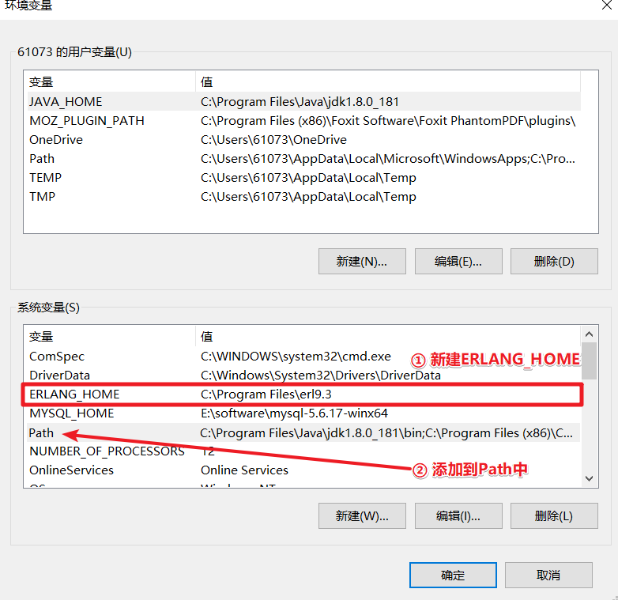
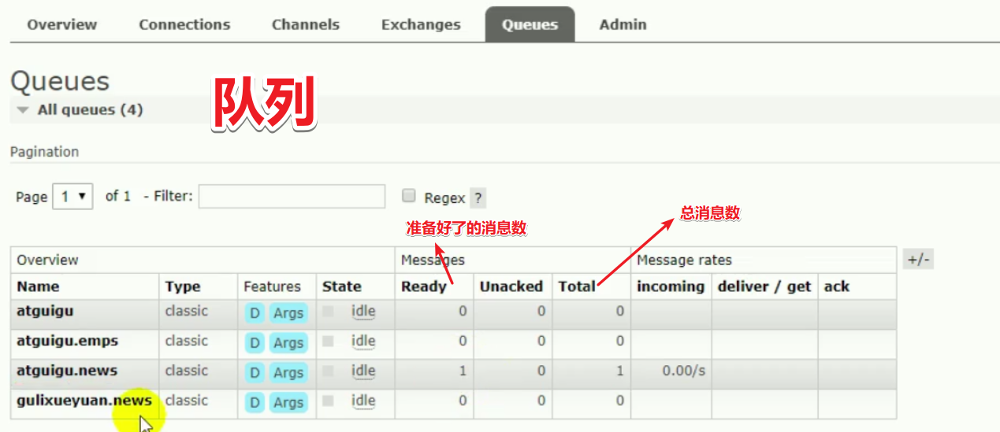
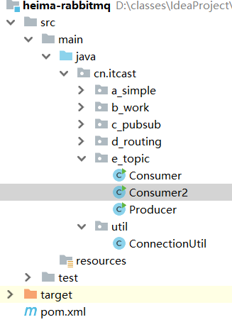
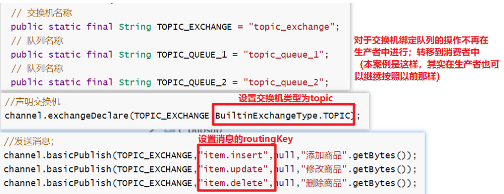

### FAQ

| session.getServletContext.getResourceAsStream()/ getClass.getResourceAsStream()/ ResourcBundle 在 SSM 框架下使用有什么要注意的 |
| ------------------------------------------------------------ |
| 我们以后都是用idea开发吗                                     |
| 袁总，好像说过要提高读代码的能力，想找一些别的项目的代码看看，能在哪里找咧 |
| web的pom文件导入jasper依赖后,报org.springframework.beans.factory.BeanCreationException: Error creating bean with name 'org.springframework.web.servlet.mvc.method.annotation.RequestMappingHandlerAdapter'错误,注释就不报,怎么回事啊? |
| 求杰哥原装lei库!!!!!!!!!!!! maven经常不会下载jar包····经常搞个pom文件环境全部弄好都花了一个小时···经常看到杰哥的Notepad++里面好像有不少好东西···要留点什么东西么 |
| 每次复制一个jsper文件进来，写好控制器程序，重新加载后，点击下载都会出现空指针异常，过一段时间后自己又好了，又能显示jsper文件 这是怎么回事？ |
| 杰哥，我们学不学oracle数据库？                               |

```java
1. 路径：        
		// "/" 相对于E:\app\apache-tomcat-8.5.31\webapps\examples
        session.getServletContext().getResourceAsStream("/");
        // 相对于E:\app\apache-tomcat-8.5.31\webapps\examples\WEB-INF\classes
        this.getClass().getResourceAsStream("/");

        // 同：this.getClass().getResourceAsStream("/");，但是不用写“/”
        this.getClass().getClassLoader().getResourceAsStream("");
加载properties配置文件：
         1.         // 加载类路径下的properties配置文件
        ResourceBundle bundle = ResourceBundle.getBundle("msg");
		msg_zh_CN.properties
			title  欢迎来到ITCAST！
	    msg_jp_JP.properties
	    	title  ののの
			

         2. Properties 也可以  msg_zh_CN.properties  / msg_jp_JP.properties

3. github / 码云
```


如何确保消息发送的可靠性？如何确保消息消费时的幂等性


### ==MQ详细介绍==

说出 Connection、Channel、Broker、exchange、queue、bingding、binding key、routing key、VHost、exchange type、fanout、direct、topic、rpc、

https://juejin.im/post/6844903968171098120#heading-15

https://www.cnblogs.com/wangiqngpei557/p/9381478.html

### 消息的==丢失==

#### 如何确保消息==发送的不丢失==？

（谷粒商城视频259：引导如何查看官方文档）

######  

首先是消息丢失：


上图中，消息发送有3个箭头，3个箭头都有可能出现意外导致消息丢失：

1. MQ宕机怎么办？
2. 生产者怎么把消息准确地发送至MQ？
3. MQ怎么把消息准确地从交换机发送至队列？

结合下面的论述，总结一下就是：我们要<font color=red>设置好消息确认模式 + 做好数据库消息发送记录</font>，3个机制需要同时实现：**发送确认模式Publisher confirm，publisher-returns，消费者消息手动确认机制**，分别对应三个回调：**`confirmCallback`，`returnCallback`，`ack`**


#### 1. MQ宕机怎么办？

​	MQ掌管交换机和队列，宕机了会造成交换机和队列数据的丢失。怎么办？

##### ==采用消息的持久化：durability message==

​	持久化：把交换机、队列和消息**三者持久化到磁盘中**。这样宕机的MQ重启后仍然能获得原本的数据（创建Exchange和队列时只要设置好持久化，发送的消息默认就是持久化消息。单单只设置Exchange持久化，重启之后队列会丢失。单单只设置队列的持久化，重启之后Exchange会消失，既而消息也丢失，所以如果不两个一块设置持久化将毫无意义。）。

###### 特殊情况：

将消息标记为持久化并不能完全保证消息不会丢失。虽然它告诉RabbitMQ将消息保存到磁盘，但是当RabbitMQ收到了一条消息并且还没有保存它时，仍然有一个短时间窗口。此外，RabbitMQ不会对每条消息都执行持久化磁盘得操作——它可能只是保存到缓存中，而不是真正写到磁盘上。持久性保证并不强。如果需要更强的保证，可以使用下面的发送发确认模式：`publisher confirm`  + MQ集群


#### 2. 生产者怎么把消息准确地发送至MQ？

###### 背景

​		MQ本身是基于异步的消息处理，前面的示例中所有的生产者（P）将消息发送到RabbitMQ后不会知道消费者（C）处理成功或者失败（甚至连有没有消费者来处理这条消息都不知道）。

​		但实际的应用场景中，我们很可能需要一些同步处理，需要同步等待服务端将我的消息处理完成后再进行下一步处理。这相当于RPC（Remote Procedure Call，远程过程调用）。在RabbitMQ中也支持RPC。

##### ==开启发送方手动确认模式：Publisher confirm==

​	也叫开启消息发送失败回调，本来是自动的，但这里使用手动。

- **机制原理**

​		客户端发送请求（消息）时，在消息的属性<font color=grey>（Message Properties，在AMQP协议中定义了14种properties，这些属性会随着消息一起发送）</font>中设置两个值，**一个是replyTo**（内容值是一个Queue名称，用于告诉MQ服务器处理完成后将通知我(生产者)的消息发送到这个Queue中）和**另一个是correlationId**（此次请求的标识号(也就是消息的唯一标识号)，服务器处理完成后需要将此属性返还，生产者客户端将根据这个id了解哪条请求被MQ服务器成功执行了或执行失败）。

​	P.s：发送方确认模式是异步的，生产者应用程序在等待确认的同时，可以继续发送消息。

- **机制原理图**

贴士tips：Client是消息生产者；Server是MQ

###### 	

- **实现实例逻辑：消息冗余 + 手动设置消息重发**

  

  谷粒商城视频259

  

  

 1. 为了确保消息能够正常发出，需要生产者服务器建立一个消息发送日志数据库表，并定时扫描。

     1. 数据库表结构（这个数据库表其实就是把数据持久化到数据库中）：9个字段，包括有消息唯一标识msgId、有效数据playload、routingKey、exchange、**状态**status(0-投递中，1-投递成功，2-投递失败)、**最大重试次数**count、**重试时间**tryTime、创建时间creatTime，更新时间updateTime。

        ​	P.s：

        1. 这里的status的2-投递成功而不是消费成功，而且是投递到MQ成功，不是投递到消费者成功
		
        2. 消息唯一标识msgId可以设置为UUID

     2. 每次发送消息，这个日志登记并描述每一条发送的消息

     3. 当 a. 消息被MQ成功接收 并且 b. 生产者也成功接收到了MQ发送回来成功接收的确认，则会回调生产者的一个函数`ConfirmCallback()`，其中这个函数将日志发送数据库表相应的消息记录的状态status设置为 1-投递成功，否则什么也不做。

 2. 重发逻辑：

      1. 创建定时器每一分钟每次扫描日志登记表，找到状态为0-投递中的消息（2-投递失败则需要人工排查）。
      2. 重发消息前：
           1. 先确认当前时间**是否大于重试时间**（如果1min重发一次，则插入消息日志表记录的时候tryTime字段设置为createTime+1min），小于tryTime字段时间则不发送
           2. 再确认**是否已经超过重发次数count**，超过则设置status状态为2-投递失败（这时需要手工通知技术人员修复（例如发短信预警））
           3. 大于重发时间 + 小于重试次数，则进行重发（更新日志记录：重发次数+1，重发时间=当前时间+1min）

#### 3. MQ怎么把消息准确地从交换机发送至队列

​		Publisher-confirm模式只能保证消息到达broker，但是不能保证消息准确投递到目标queue中。我们需要保证消息一定要投递到目标queue中，这时候就需要 Publisher-returns模式（模拟投递失败的场景可以将routing-key故意写错）

##### ==开启队列路由失败模式：publisher-returns==

​		消息从交换机发送至队列，**若投递队列失败，则会回调函数`ReturnCallback()`，**在这个函数中我们可以记录下详细到投递数据，定期的巡检或者自动纠错都需要这些数据。

##### 如何避免消息重复投递进队列？

​		在消息生产时，MQ内部针对每条生产者发送的消息生成一个inner-msg-id，作为去重和幂等的依据。当消息投递失败并重传时根据该ID避免重复的消息进入队列。

注：`mandatory=true`设置消息是否退回，为true则为 退回，为false则为删除。要做到可靠性，当然是选择退回到客户端，让我们把退回的消息再做处理，比如放到一个新的队列单独处理，路由失败一般都是配置问题了（如routing-key错了）。


 


#### 如何确保消息==接收不丢失==？

###### 从2个可能出现的问题确保消息接收的可靠性

	1. 当MQ明确消息被一个或多个目标消费者收到(且完成消费)，那么该消息就会被MQ从队列中移除。（消息没有消费者订阅，则会一直在队列中）。那么MQ是如何明确的呢？答：采用手动消费者消息确认机制。
	2. 重复消费（如何保证消费者消费消息的幂等性）

==**开启消费者消息<font color=red>手动</font>确认机制：ACK**==：`acknowledge-mode: manual`

​		消息确认机制是：消费者接收每一条消息后都必须进行确认(ACK)（消息接收和消息确认是两个不同操作），只有消费者确认了消息，RabbitMQ才能安全地把消息从队列中删除。所以**我们要做的就是，如何在让消费者确切消费了消息才发送确认ACK**。这时候就是要我们自己配置了，也就是由**自动确认机制**（默认）转变为**手动确认机制**（自动确认机制再消费者接收到 消息就确认了，而不是等到消费者完全消费了消息才确认，自动确认机制是不能保证可靠的）。


消息被消费者收到了，但是没有Ack，消息就一直是unacked状态。当Consumer宕机了消息也不会丢失，消息会重新变成Ready状态


PS:`basicNack(long deliveryTag, booleanmultiple, boolean requeue)`和`basicReject()`都是拒收。参数`requeueb表示是否从队列中删除这个被拒绝的消息（是否重新入队），false则为丢弃不入队，true为重新入队，重新入队就会再此发送消息 

### 消息==重复==

==**如何避免消息重复消费？（保证幂等性）**==

1. 什么时候会重复发送消息？
   1. 场景一：消费者成功收到消息并成功消费消息，但是在发送确认回调的时候出了问题宕机或者网络中断了了，和MQ失去了联系，导致确认ACK没有成功发送。由于和MQ实去了联系，MQ的服务器就会认为消息没有处理成功，就会把消息的状态重新由`unack`变成`ready`，这个状态会使MQ再此把该消息发送给别的消费者，导致消息重复消费
   2. 场景二：消费者成功收到消息，但是消费失败了，消费者返回了一个rejectACK，这时候MQ由于重试机制，便再次发送了一次消息
2. 解决：（只需解决场景一，场景二的重发是符合实际的）
   1. 办法一：设置消费者消费消息的接口为幂等，如此一来即使多次消费，结果都会是幂等的。例如：防重表。发送的消息每一个都有业务的唯一标识，处理过就不用处理了，（在消息消费时，要求消息体中必须要有一个bizId（对于同一业务全局唯一，如支付ID、订单ID、帖子ID等）作为去重和幂等的依据，避免同一条消息被重复消费，将这个bizID设置到消息的correlationId属性中）
   2. 办法二：rabbitMQ的每一个消息都有`redelivered`字段，可以获取知道当前消息是否是被重新投递过来的。（这种有点暴力，顾此失彼了。因为假如当前消息之所以重发因为场景二的原因，那就不适合了）

- **避免重复消费的实际应用举例**

1. 比如，你拿到这个消息做数据库的insert操作。那就容易了，给这个消息做一个唯一主键，那么就算出现重复消费的情况，就会导致主键冲突，避免数据库出现脏数据
2. 再比如，你拿到这个消息做redis的set的操作，那就容易了，不用解决，因为你无论set几次结果都是一样的，set操作本来就算幂等操作。
3. 如果上面两种情况还不行，上大招。准备一个第三方介质,来做消费记录。以redis为例，给消息分配一个全局id，只要消费过该消息，将<id,message>以K-V形式写入redis。那消费者开始消费前，先去redis中查询有没消费记录即可。

###### 第3个方案实现实例逻辑

1. 消息接收到后，消费者进行消息的消费。然后把消息存入到redis缓存中，采用哈希格式，key1为业务类别(例如mail_log)，key2为消息的唯一标识（消息的属性correlationId），value为任意值。完成之后就发送一个确认ACK（`channel.basicAck(Tag tag,...`）
2. 如果上述过程中失败，则发送一个`channel.basicNack(tag, ..)`，表明消息没有成功消费，通知MQ不要移除本条消息
3. 以后为保证消息消费的幂等性，消费者消费消息之前需要查看缓存redis中是否存在该消息的correlationId，存在则表明消息已经消费过了，返回一个确认ACK（`channel.basicAck(Tag tag,...`）

### 消息==积压==

1. 出现的场景：
   1. MQ没有联系上任何一个消费者，或者消费者太少了消费者的消费能力不足
   2. 发送端的流量太大
2. 解决：
   1. 从消费端解决：
      1. ​	提供更多的消费者
      2. 上线专门的队列消费服务，将消息先批量取出来，记录数据库，离线慢慢处理
   2. 从发送端解决：限流

### ==延时队列==

1. 为什么要用MQ的延迟队列：
   1. 有一种场景经常遇见：未付款的订单，超过一定的时间后，系统自动取消订单并释放占有的物品。
   2. 常用的解决方案：springSchedule定时任务轮询数据库
      1. 不足：
         1. 消耗系统内存，
         2. 增加数据库的压力(定时全表扫描)，
         3. 存在较大的时间误差
      2. 解决这个不足：rabbitMQ的**消息TTL**和**死信Exchange**结合：routing-key为A的消息发送到死信队列，TTL一到，变成死信，故消息被扔到了死信交换机，死信交换机再根据routing-key把消息路由到相应的队列，消费者收到消息后消费。
   3. 总结：rabbitMQ的延时队列是为了实现“定时任务的效果”
2. 
3. 延时队列原理
   1. 消息的TTL(Tim To Live)
      1. 
   2. 死信交换机DLX（Dead Letter Exchange）
      1. 
4. 延时队列的实现
   1. 实现1：设置队列中消息的过期时间（**队列设置过期时间**）
      1. P：消息发送者；C：消息消费者；X：交换机；delay.5m.queue：死信队列：delay.5m.queue，这是死信队列是一个设置了特殊属性的队列（设置了TTL为300000ms，设置了死信交换机delay.exchange，设置了路由键是delay.message），同时这个队列是没有任何消费者去拿消息的，最终的结果是消息一定会过期并被发送到指定的死信交换机delay.exchange；
   2. 实现2：设置生产者发送的消息的过期时间（**消息设置过期时间**）
      1. P：消息发送者；C：消息消费者；消费者发送的消息设置了过期时间TTL为300000ms；交换机；死信队列：delay.5m.queue：一个设置了特殊属性的队列，设置了死信交换机delay.exchange，设置了路由键是delay.message，同时这个队列是没有任何消费者去拿消息的，最终的结果是消息一定会过期并被发送到指定的私信交换机；
      2. 注：一般来说我们都是采用实现1的设置队列的过期时间。因为RabbitMQ采用的是惰性检查机制：例如当生产者按顺序发给队列3个消息，过期时间分别为10min，3min和1min，这时MQ看到第一个消息的过期时间是10min，便不会去看下一个消息的过期时间，直接等10min将该消息放入私信交换机之后才去看第二个消息的过期时间；而给队列设置过期时间，MQ会直接检查整个队列的消息所有的过期时间，一旦超过过期时间就直接拿到死信交换机


### 学习目标

能够说出什么是消息队列
能够安装RabbitMQ
能够编写RabbitMQ的入门程序
能够说出RabbitMQ的5种模式特征
能够使用Spring整合RabbitMQ

学习路径：


### ==消息队列==概述（一）介绍

#### 目标

1. 能够说出什么是消息队列？
2. 为什么使用消息队列？
3. 常见消息队列产品有哪些？

#### 什么是消息队列

==MQ==全称为Message Queue，消息队列是==应用程序和应用程序之间的通信方法==。

#### ==为什么使用MQ？==

> 在项目中，可将一些**无需即时返回且耗时的操作**提取出来，进行了异步处理，而这种异步处理的方式大大的节省了服务器的请求响应时间，从而提高了系统的吞吐量。

> 开发中消息队列通常有如下应用场景：
> <font color=red>1、任务异步处理，流量削峰：</font>将不需要同步处理的并且耗时长的操作由【消息队列】通知【消息接收方】进行异步处理。提高了应用程序的响应时间。（**消息发送方发送消息，消息队列存储消息，消息接收方处理消息**） 
> <font color=red>2、应用程序解耦合：</font>MQ相当于一个中介，生产方通过MQ与消费方交互，它将应用程序进行解耦合。**无论是生产者发送还是消费者接收消息，都与对方无关，因为发送和接收的对象都是队列(RabbitMQ)**

> 如图


#### 消息队列产品

市场上常见的消息队列有如下：

- ActiveMQ：基于JMS
- ZeroMQ：基于C语言开发
- RabbitMQ：基于AMQP协议，erlang语言开发，稳定性好
- RocketMQ：基于JMS，阿里巴巴产品
- Kafka：类似MQ的产品；分布式消息系统，高吞吐量

#### 小结

消息队列是应用程序之间的通信方法；异步处理提高系统吞吐量，可以实现程序之间的解耦合；

- 常见产品：ActiveMQ,RabbitMQ,ZeroMQ,RocketMQ,Kafka
- 实现方式：AMQP/JMS

==好处==：

​	应用解耦

​	异步处理

​	流量削锋

​	提高系统的并发访问效率，高可用。

### 消息队列概述（二）==AMQP== 和==JMS==

#### 介绍

MQ是消息通信的模型；实现MQ的大致有两种主流方式：AMQP、JMS。

<font color=red><b>AMQP：</b></font>AMQP**是一种协议，所以使用它时不受开发语言等条件的限制。**erlang语言开发，依赖erlang语言，，更准确的说是一种binary wire-level protocol（链接协议）。这是其和JMS的本质差别，AMQP不从API层进行限定，而是**直接定义网络交换的数据格式**。

<font color=red><b>JMS：</b></font>JMS即Java消息服务（Java Message Service）,**是java应用程序接口(API)，依赖于java语言**，是一个Java平台中关于面向消息中间件（MOM）的API，用于在两个应用程序之间，或分布式系统中发送消息，进行异步通信。（ActiveMQ）

#### AMQP 与JMS ==区别==

* **是什么？**JMS是定义了统一的接口，来对消息操作进行统一；AMQP是通过规定协议来统一数据交互的格式

* **实现方式？**JMS限定了必须使用Java语言；AMQP只是协议，不规定实现方式，因此是跨语言的。

* **拥有的消息模型？**JMS规定了两种消息模型：简单模式（点对点） 和 发布与订阅（广播）；而AMQP的消息模型更加丰富


### rabbitMQ的核心概念

谷粒商城视频249


1.  消息由“头”+“体”组成，“头“包含的是消息的属性，我们可以设置，例如路由键`router-key`；“体”是消息的内容，是我们要传输的数据
2. 消息代理内部有交换机，交换机可以有多个。当生产者发送消息到消息代理，先发送给代理内部的交换机，交换机再根据路由键`route-key`发送给相应的队列，队列负责存储消息；交换机和队列之间的关系称为”**Binding**“：**交换机和队列的关系是多对多**，一个交换机可以绑定多个队列，一个队列可以绑定多个交换机；PS:交换机也可以和交换机绑定。
3. 一个客户端(生产者或消费者)和消息代理只会建立一条连接，而且这个连接是长连接（并不是一个客户端和一个队列建立一个连接；长连接的好处是当客户端宕机时消息代理可以快速感知做出反应，避免消息的大量丢失）。然后一个连接开辟多条信道channel（打个比方：连接就是一条大马路，信道就是大马路上的多条车道）。每个信道都会去监听队列
4. 一个消息代理可以开辟多个虚拟主机，这些虚拟主机相互隔离，互不影响（例如可以开辟为生产、开发、测试环境）


**交换机Exchange类型**（谷粒商城251）

direct和headers都是点对点的，而fanout和topic是发布订阅的。headers的性能相对低下，现在基本不使用


1. direct直接
   1. 点对点、route-key完全匹配、单播
2. fanout扇出
   1. 相当于广播，不关心路由键route-key是什么
3. topic主题
   1. 也相当于广播，但是是部分广播，和route-key相关
4. headers


### 安装及配置RabbitMQ（1）==windows==

#### 目标

按照文档在本机安装windows版本RabbitMQ，并配置其用户和Virtual Hosts

#### 步骤

1. 安装erlang；
2. 安装RabbitMQ；
3. 安装管理插件
4. 创建管理RabbitMQ的用户；
5. 创建虚拟主机Virtual Hosts

#### 安装&配置

1. 安装erlang

   （erlang语言是rabbitMQ的底层通信语言）

   <font color=green>图1：点击安装文件进行安装，注意最好以管理员身份运行：</font>

   &nbsp;

   <font color=green>图2：配置环境变量</font>

   &nbsp;

2. 安装RabbitMQ

   &nbsp;

3. 安装管理插件

   （“管理插件”是为了能够给进入http://localhost:15672页面）

   打开cmd，先进入sbin目录；

   再执行命令：<font color=red>rabbitmq-plugins.bat enable rabbitmq_management</font>

   如下图：

   

4. 创建管理RabbitMQ的用户；

   访问地址：http://localhost:15672

   登陆用户： guest/guest  （默认）--->windows下这个没有禁用，linux下这个是禁用的

   <font color=red>添加==用户==</font>

   账户：chosen

   密码：888

   

5. 创建==虚拟主机Virtual Hosts==。

   ```text
   像mysql拥有数据库的概念并且可以指定用户对库和表等操作的权限。RabbitMQ也有类似的权限管理；在RabbitMQ中可以虚拟消息服务器Virtual Host(虚拟主机)，【每个Virtual Hosts相当于一个相对独立的RabbitMQ服务器】，每个VirtualHost之间是相互隔离的。特定的exchange、queue、message只能属于一个虚拟主机，不能互通。 相当于mysql的db。Virtual Name一般以/开头。在实际开发中，virtual Host用来划分环境，如开发/测试/生产环境。
   ```

   <font color=green>图1：新建虚拟主机</font>

   ​	一定要加个“/”

   

​      <font color=green>图2：设置Virtual Hosts权限</font>


   图3：设置虚拟主机的授权访问用户   




#### 小结

> 安装流程如下


> 注意： 安装erlange和RabbitMQ的时候需要使用 管理员身份安装。


### 安装及配置RabbitMQ（2）==linux==

计算机的名字、操作系统的名字是中文的容易安装错误

#### 安装erlang

```
# 安装依赖环境支持
sudo yum install -y gcc gcc-c++ glibc-devel make ncurses-devel openssl-devel autoconf java-1.8.0-openjdk-devel git
```

```
# (后面要用wget，先确保安装)       [可选]
yum -y install wget
```

```
# 上传资料包中的文件：otp_src_20.2.tar.gz					  [本地已有]
# 或者在线下载erlang （比较慢）
wget http://erlang.org/download/otp_src_20.2.tar.gz      [可选]

#解压
tar -zxvf otp_src_20.2.tar.gz 

#进入解压目录
cd otp_src_20.2

#编译&安装
./otp_build autoconf
./configure && make && sudo make install

#测试是否安装成功
#进入erlang命令行表示成功 [root@localhost otp_src_20.2]# erl    [可选]
#退出erlang命令行: halt().
```

```
#安装 socat
sudo yum install -y socat
```

#### RabbitMQ 安装

```
# 上传资料中的rabbitmq-server-3.7.4-1.el7.noarch.rpm， 再安装			[本地已有]
sudo rpm --nodeps -Uvh rabbitmq-server-3.7.4-1.el7.noarch.rpm

# 或者在线安装  （比较慢）
sudo rpm --nodeps -Uvh https://github.com/rabbitmq/rabbitmq-	server/releases/download/v3.7.4/rabbitmq-server-3.7.4-1.el7.noarch.rpm    [可选]

```

```
#查看状态
systemctl status rabbitmq-server

#启动服务
systemctl start rabbitmq-server

#设置为开机启动
systemctl enable rabbitmq-server

#重启服务
systemctl restart rabbitmq-server
```

```
安装web管理页面插件（先启动rabbitmq服务）：
rabbitmq-plugins enable rabbitmq_management
```

#### 访问控制台、

==端口==：15672

##### 访问

在Linux平台，guest这个账户默认是禁用的；需要修改禁用列表


##### 分析

```
原因：rabbitmq从3.3.0开始禁止使用guest/guest权限通过除localhost外的访问

找到这个文件rabbit.app
/usr/lib/rabbitmq/lib/rabbitmq_server-3.7.7/ebin/rabbit.app

将：{loopback_users, [<<”guest”>>]}，
改为：{loopback_users, []}，

```

##### 配置

```
[root@localhost ~]# whereis rabbitmq
rabbitmq: /usr/lib/rabbitmq /etc/rabbitmq

[root@localhost ~]# cd /usr/lib/rabbitmq
[root@localhost rabbitmq]# ls
autocomplete  bin  lib

[root@localhost rabbitmq]# cd lib
[root@localhost lib]# ls
rabbitmq_server-3.7.4

[root@localhost lib]# cd rabbitmq_server-3.7.4/
[root@localhost rabbitmq_server-3.7.4]# ls
ebin  escript  include  plugins  priv  sbin

[root@localhost rabbitmq_server-3.7.4]# cd ebin

[root@localhost ebin]# vi rabbit.app
将：{loopback_users, [<<”guest”>>]}，
改为：{loopback_users, []}，

改完后，记得重启服务：systemctl restart rabbitmq-server
```


##### 测试

图1：


图2：

创建用户： /heima  

密码：       888

虚拟主机：/itcast


### RabbitMQ==5种工作模式==

#### 官网

<font color=red><b>地址：</b></font>https://www.rabbitmq.com/getstarted.html

<font color=red><b>查看RabbitMQ工作模式：</b></font>


#### 说明

<font color=red><b>查看RabbitMQ工作模式说明：</b></font>这里介绍5种(其实有六种)，==大略可分为2类5种==

1. ```
   1. 不使用交换机（非订阅模式）
      1. 简单
      2. 工作队列
   2. 使用交换机（订阅模式）
      1. 类型： fanout  广播          大家回家收衣服
      2. 类型： direct   路由         张三回家收衣服
      3. 类型： topic   通配符        姓张的回家收衣服 
   ```

   2.basicPublish()：第一个参数必定是交换机名称，第二个参数可以是队列名，也可以是routingkey


RabbitMQ工作模式：   

1、简单模式HelloWorld: 一个生产者、一个消费者，不需要设置交换机（使用默认的交换机）

P   Producer   生产者： 发送消息到队列

C   Consumer  消费者： 消费队列消息


2、工作队列模式Work Queue= 一个生产者、多个消费者（竞争关系），不需要设置交换机（使用默认的交换机）


3、发布订阅模式Publish/subscribe,需要设置类型为<font color=red><b>fanout</b></font>的交换机，并且交换机和队列进行绑定，当发送消息到交换机后，交换机会将消息发送到绑定的队列。**（只要队列与交换机绑定了，消息就能送到这个队列）**

X  Exchange 交换机


4、路由模式Routing 需要设置类型为<font color=red><b>direct</b></font>的交换机，交换机和队列进行绑定，并且指定routing key，当发送消息到交换机后，交换机会根据routing key将消息发送到对应的队列。**（队列不仅要与交换机绑定，还要绑定一个routing key信息，于此同时，消息也绑定一个routing key信息，只有1.绑定了交换机，且2.routing key信息一致，消息才能送到这个队列）**

==比fanout多了一步：指定routing key==


5、通配符模式Topic需要设置类型为<font color=red><b>topic</b></font>的交换机，交换机和队列进行绑定，并且指定通配符方式routing key，当发送消息到交换机后，交换机会根据routing key将消息发送到对应的队列==与direct不同的是：routing key是通配符方式的==


#### 小结

消息模型

1. 不使用交换机
   1. 简单
   2. 工作队列
2. 使用交换机
   1. 类型：fanout  广播         大家回家收衣服
   2. 类型： direct   路由          张三回家收衣服
   3. 类型： topic   通配符        姓张的回家收衣服 


### RabbitMQ工作模式-==基本消息模型==（一）消息生产者==详解生产、消费者代码==

#### 目标

编写消息生产者代码，发送消息到队列

#### 环境准备

1. 访问控制台主页：http://192.168.12.132:15672

   创建用户：heima/888

   创建虚拟主机：/itcast

   给/itcast虚拟主机分配heima用户的访问权限

2. 创建heima-rabbitmq的工程；添加用于操作rabbitMQ的依赖；

```xml
        <dependency>
            <groupId>com.rabbitmq</groupId>
            <artifactId>amqp-client</artifactId>
            <version>5.6.0</version>
        </dependency>
```

#### 分析

生产者发送消息到RabbitMQ的某个队列，消费者从队列中获取消息。可以使用rabbitMQ的简单模式（simple）；生产者发送消息步骤：

1. 创建连接工厂（设置连接相关参数）；
2. 创建连接；
3. 创建频道；
4. 声明队列；
5. 发送消息；
6. 关闭资源；

#### 实现

1. 工程如下

   

2. 编写消息生产者

   ```java
   package cn.itcast.a_simple;
   
   import com.rabbitmq.client.Channel;
   import com.rabbitmq.client.Connection;
   import com.rabbitmq.client.ConnectionFactory;
   
   /**
    * 消息模型（1）简单模型： 生产者
    *
    * 特点： 一个生产者一个消费者
    *
    */
   public class Producer {
       // 消息发送的目的地：simple_queue 这个队列
       static final String QUEUE_NAME = "simple_queue";
   
       public static void main(String[] args) throws Exception {
           //1. 创建连接工厂（设置连接相关参数）；
           ConnectionFactory factory = new ConnectionFactory();
           factory.setHost("192.168.12.132");//设置消息队列所在ip地址
           factory.setPort(5672);//设置消息队列所占用的端口
           factory.setVirtualHost("/itcast");//设置虚拟主机的名字
           factory.setUsername("heima");//设置可以访问该虚拟主机的用户名
           factory.setPassword("888");//设置可以访问该虚拟主机的密码
           //2. 创建连接；
           Connection connection = factory.newConnection();
           //3. 创建频道；(关键对象)
           Channel channel = connection.createChannel();
           //4. 声明队列；
           // 参数1：队列名称
           // 参数2：是否持久化队列。如果持久化队列，重启服务队列依然存在。
           // 参数3：是否独占本次连接
           // 参数4：是否自动删除
           // 参数5：队列其他参数
           channel.queueDeclare(QUEUE_NAME,true,false,false,null);
           //5. 发送消息；
           String msg = "Hello,Rabbit!";
           /**
            * 参数1：交换机名称，如果没有指定则使用默认Default Exchage
            * 参数2：路由key,简单模式要传递队列名称
            * 参数3：消息其它属性
            * 参数4：消息内容
            */
           //这一条语句实际上就是往指定队列发送消息
           channel.basicPublish("",QUEUE_NAME,null,msg.getBytes());
           //6. 关闭资源；
           channel.close();
           connection.close();
       }
   }
   
   ```

#### 小结

window下的本机rabbitmq中，在设置连接工厂的时候；如果没有指定连接的一系列参数的话；那么会有默认值。主要去设置虚拟主机。


### RabbitMQ工作模式-基本消息模型（二）消息消费者

#### 目标

编写消息消费者代码，从队列中接收消息并消费

#### 分析

从RabbitMQ的队列中接受消息；实现消息消费者：

1. 创建连接工厂；
2. 创建连接；
3. 创建频道；
4. 声明队列；
5. 创建消费者（接受消息并处理消息）；
6. 监听消息队列

#### 预览


#### 实现

第一步：消息的消费者，==也需要创建连接对象==，这些代码与消息的生产者中创建连接的代码是一样的。所以，这里抽取出工具类返回连接对象后，再实现消息消费。

```java
package cn.itcast.util;

import com.rabbitmq.client.Connection;
import com.rabbitmq.client.ConnectionFactory;

public class ConnectionUtil {
    public static Connection getConnectionFactory() throws Exception {
        //1. 创建连接工厂（设置连接相关参数）；
        ConnectionFactory factory = new ConnectionFactory();
        factory.setHost("192.168.12.132");
        factory.setPort(5672);
        factory.setVirtualHost("/itcast");
        factory.setUsername("heima");
        factory.setPassword("888");
        return factory.newConnection();
    }
}

```

第二步：实现消息消费

```java
package cn.itcast.a_simple;

import cn.itcast.util.ConnectionUtil;
import com.rabbitmq.client.*;

import java.io.IOException;

/**
 * 消息模型（1）简单模型： 消费者
 */
public class Consumer {

    public static void main(String[] args) throws Exception {
        //1. 创建连接工厂；
        //2. 创建连接；
        Connection connection = ConnectionUtil.getConnectionFactory();
        //3. 创建频道；
        Channel channel = connection.createChannel();
        //4. 声明队列；
        
        channel.queueDeclare(Producer.QUEUE_NAME,true,false,false,null);
        //5. 创建消费者（接受消息并处理消息）；
        DefaultConsumer consumer = new DefaultConsumer(channel){
            @Override
            public void handleDelivery(
                    String consumerTag, 
                	Envelope envelope,
                    AMQP.BasicProperties properties, 
                	byte[] body) throws IOException {
                
                System.out.println("交换机:"+envelope.getExchange());
                System.out.println("路由key:"+envelope.getRoutingKey());
                System.out.println("消息ID:"+envelope.getDeliveryTag());
                System.out.println("消息内容： " + new String(body));
            }
        };
        //6. 监听消息队列
        // 参数1：队列名称
        // 参数2：是否自动应答（消费者从容器中取出消息后，是否要通知容器？）
        // 参数3：消费者对象（指明是哪一个消费者。参数是Consumer接口类型，DefaultConsumer是它的实现类。）
        //监听器实际上就是接收指定队列的消息
        channel.basicConsume(Producer.QUEUE_NAME,true,consumer);

        // 注意：这里不要关闭...
        //channel.close();
        //connection.close();
        //这是因为程序执行很快，此处若关闭了监听器(connection和channel)，消费者就没办法收到消息了（甚至一条消息都接收不了）
    }


}

```

#### 注意

> 在启动消息监听之后不要把资源关闭。


### RabbitMQ工作模式-基本消息模型（二）测试

#### 目标

启动消费者和生产者，到RabbitMQ中查询队列并在消费者端IDEA控制台查看接收到的消息

#### 分析

生产者发送消息到rabbitMQ队列（simple_queue），消费者从队列中接收消息；使用了简单模式（simple）

#### 小结

简单模式：

1. 生产者发送消息到队列中，消费者从队列中接收消息；
2. 在rabbitMQ中消费者只能从队列中接收到消息。
3. 思考：如果接收消息的消费者在同一个队列中有多个时，消息是如何分配的？


### RabbitMQ工作模式-==Work queues==工作队列模式

#### 目标

编写生产者、消费者代码并测试了解Work queues工作队列模式的特点

#### 分析

工作队列模式Work Queue： 一个生产者、多个消费者（竞争关系），不需要设置交换机（使用默认的交换机）

1. 在同一个队列中可以有多个消费者监听消息；消费者之间对于消息**是竞争关系**。

2. 生产者：发送30个消息；创建两个消费者去监听同一个队列，查看两个消费者接收到的消息是否存在重复。

3. 如图

   

#### 消息生产者


```java
package cn.itcast.b_work;

import com.rabbitmq.client.Channel;
import com.rabbitmq.client.Connection;
import com.rabbitmq.client.ConnectionFactory;

/**
 * 消息模型（2）工作队列： 生产者,发送多个消息
 *
 * 特点： 一个生产者一个消费者
 *
 */
public class Producer {
    // 消息发送的目的地：simple_queue 这个队列
    static final String QUEUE_NAME = "simple_queue";

    public static void main(String[] args) throws Exception {
        //1. 创建连接工厂（设置连接相关参数）；
        ConnectionFactory factory = new ConnectionFactory();
        factory.setHost("192.168.12.132");
        factory.setPort(5672);
        factory.setVirtualHost("/itcast");
        factory.setUsername("heima");
        factory.setPassword("888");
        //2. 创建连接；
        Connection connection = factory.newConnection();
        //3. 创建频道；(关键对象)
        Channel channel = connection.createChannel();
        //4. 声明队列；
        channel.queueDeclare(QUEUE_NAME,true,false,false,null);
        //5. 发送消息；
        /**
         * 参数1：交换机名称，如果没有指定则使用默认Default Exchage
         * 参数2：路由key,简单模式要传递队列名称
         * 参数3：消息其它属性
         * 参数4：消息内容
         */
        for (int i = 0; i < 10; i++) {
            String msg = "Hello,Rabbit!" + i;
            channel.basicPublish("",QUEUE_NAME,null,msg.getBytes());
        }
        //6. 关闭资源；
        channel.close();
        connection.close();
    }
}

```

#### 消息消费者

```java
package cn.itcast.b_work;

import cn.itcast.util.ConnectionUtil;
import com.rabbitmq.client.*;

import java.io.IOException;

/**
 * 消息模型（2）工作队列： 消费者1
 */
public class Consumer {

    public static void main(String[] args) throws Exception {
        //1. 创建连接工厂；
        //2. 创建连接；
        Connection connection = ConnectionUtil.getConnectionFactory();
        //3. 创建频道；
        Channel channel = connection.createChannel();
        //4. 声明队列；
        channel.queueDeclare(Producer.QUEUE_NAME,true,false,false,null);
        //5. 创建消费者（接受消息并处理消息）；
        DefaultConsumer consumer = new DefaultConsumer(channel){
            @Override
            public void handleDelivery(
                    String consumerTag, Envelope envelope,
                    AMQP.BasicProperties properties, byte[] body) throws IOException {
                System.out.println("交换机:"+envelope.getExchange());
                System.out.println("路由key:"+envelope.getRoutingKey());
                System.out.println("消息ID:"+envelope.getDeliveryTag());
                System.out.println("消息内容： " + new String(body));
            }
        };
        //6. 监听消息队列
        channel.basicConsume(Producer.QUEUE_NAME,true,consumer);

        // 注意：这里不要关闭...
    }


}

```

```java
package cn.itcast.b_work;

import cn.itcast.util.ConnectionUtil;
import com.rabbitmq.client.*;

import java.io.IOException;

/**
 * 消息模型（2）工作队列： 消费者1
 */
public class Consumer2 {

    public static void main(String[] args) throws Exception {
        //1. 创建连接工厂；
        //2. 创建连接；
        Connection connection = ConnectionUtil.getConnectionFactory();
        //3. 创建频道；
        Channel channel = connection.createChannel();
        //4. 声明队列；
        channel.queueDeclare(Producer.QUEUE_NAME,true,false,false,null);
        //5. 创建消费者（接受消息并处理消息）；
        DefaultConsumer consumer = new DefaultConsumer(channel){
            @Override
            public void handleDelivery(
                    String consumerTag, Envelope envelope,
                    AMQP.BasicProperties properties, byte[] body) throws IOException {
                System.out.println("交换机:"+envelope.getExchange());
                System.out.println("路由key:"+envelope.getRoutingKey());
                System.out.println("消息ID:"+envelope.getDeliveryTag());
                System.out.println("消息内容： " + new String(body));
            }
        };
        //6. 监听消息队列
        channel.basicConsume(Producer.QUEUE_NAME,true,consumer);

        // 注意：这里不要关闭...
    }


}

```

#### 小结

工作队列模式：一个消息只能被一个消费者接收，其它消费者不能接收到。

应用场景：在消费者端任务处理时，如果配置了多个消费者可以提高任务处理效率。


### RabbitMQ工作模式-==订阅模式==介绍

#### 目标

理解订阅模式中的Exchange交换机作用以及交换机的三种类型。

#### 说明

> 前面2个案例中，只有3个角色：
> ​	P：生产者，也就是要发送消息的程序
> ​	C：消费者：消息的接受者，会一直等待消息到来。
> ​	queue：消息队列，图中红色部分


> 而在订阅模型中，多了一个exchange角色，而且==过程略有变化==：--->==**这里的变化只涉及消息和队列**==

* P：生产者，也就是要发送消息的程序，但是**不再发送到队列中，而是发给X（交换机）**
* C：消费者，消息的接受者，会一直等待消息到来。
* Queue：消息队列，接收消息、缓存消息。	
* <font color=red>Exchange：</font>交换机，图中的X。一方面，接收生产者发送的消息。另一方面，知道如何处理消息，例如把消息递交给某个特别队列、递交给所有队列、或是将消息丢弃。也就是说，到底如何操作，取决于Exchange的类型。Exchange有常见以下3种类型：

  * <font color=red>Fanout：</font>广播，将消息交给所有绑定到交换机的队列

  * <font color=red>Direct：</font>定向，把消息交给符合指定routing key 的队列

  * <font color=red>Topic：</font>通配符，把消息交给符合routing pattern（路由模式） 的队列

    Exchange（交换机）只负责转发消息，不具备存储消息的能力，因此如果没有任何队列与Exchange绑定，或者没有符合路由规则的队列，那么消息会丢失！

> 订阅模式示例图：

<font color=blue>图1：交换机类型为Fanout</font>


<font color=blue>图2：交换机类型为Direct</font>


<font color=blue>图3：交换机类型为Topic</font>


#### 小结

订阅模式与前面的模式多了一个角色：Exchange交换机，接收数据并决定如何将数据转发投递到不同的队列；消息的投递决定于交换机的类型。

Exchange交换机的类型：广播fanout，定向direct，通配符topic

> 交换机是只做消息的转发投递，自身不存储数据


### RabbitMQ工作模式-==Publish/Subscribe发布与订阅模式：fanout交换机==（广播）

#### 目标

编写生产者、消费者代码并测试了解Publish/Subscribe发布与订阅模式的特点


#### 模式说明

* 发布订阅模式：

  * 1、每个消费者监听自己的队列。

  * 2、生产者将消息发给交换机，由交换机将消息转发到绑定此交换机的每个队列，**==每个==绑定交换机的队列都将接收 到消息**

  * 3、如图

    


#### 分析

发布与订阅模式特点：一个消息可以被多个消费者接收；其实使用的是订阅模式交换机类型为：广播

- 生产者（发送10个消息）

1. 创建连接；
2. 创建频道；
3. <font color=red>声明交换机；</font>
4. 声明队列；
5. <font color=red>队列绑定到交换机；</font>
6. 发送消息；
7. 关闭资源

- 消费者（至少要有两个）

1. 创建连接；
2. 创建频道；
3. 声明交换机；
4. 声明队列；
5. 队列绑定到交换机；
6. 创建消费者，处理消息；
7. 监听队列；

#### 消息生产者


相比前面的，多了下面这些代码


```java
package cn.itcast.c_pubsub;

import cn.itcast.util.ConnectionUtil;
import com.rabbitmq.client.BuiltinExchangeType;
import com.rabbitmq.client.Channel;
import com.rabbitmq.client.Connection;
import com.rabbitmq.client.ConnectionFactory;

/**
 * 消息模型（3）发布/订阅     生产者
 *            exchange：fanout 交换机类型为广播
 *
 * 发布订阅模式Publish/subscribe
 *   1.需要设置类型为fanout的交换机
 *   2.并且交换机和队列进行绑定，当发送消息到交换机后，交换机会将消息发送到绑定的队列
 */
public class Producer {
    // 交换机名称
    public static final String FANOUT_EXCHANGE = "fanout_exchange";
    // 队列名称
    public static final String FANOUT_QUEUE_1 = "fanout_queue_1";
    // 队列名称
    public static final String FANOUT_QUEUE_2 = "fanout_queue_2";

    public static void main(String[] args) throws Exception {
        //1. 创建连接；
        Connection connection = ConnectionUtil.getConnectionFactory();
        //2. 创建频道；(关键对象)
        Channel channel = connection.createChannel();

        //3. 声明交换机,指定交换机类型：fanout广播  [............]
        channel.exchangeDeclare(FANOUT_EXCHANGE, BuiltinExchangeType.FANOUT);

        //4. 声明队列；
        channel.queueDeclare(FANOUT_QUEUE_1,true,false,false,null);
        channel.queueDeclare(FANOUT_QUEUE_2,true,false,false,null);

        //6. 队列绑定到交换机                   [..............]
        //第三个参数是routing key，因为是FANOUT模式，所以没有
        channel.queueBind(FANOUT_QUEUE_1,FANOUT_EXCHANGE,"");
        channel.queueBind(FANOUT_QUEUE_2,FANOUT_EXCHANGE,"");

        //7. 发送消息；
        /**
         * 参数1：交换机名称，如果没有指定则使用默认Default Exchage
         * 参数2：路由key,简单模式要传递队列名称
         * 参数3：消息其它属性
         * 参数4：消息内容
         */
        for (int i = 0; i < 10; i++) {
            String msg = "Hello,Rabbit!" + i;
            // 发消息时候只指定了交换机，那么绑定了该交换机的队列都可以收到消息
            channel.basicPublish(FANOUT_EXCHANGE,"",null,msg.getBytes());
        }
        //关闭资源；
        channel.close();
        connection.close();
    }
}

```

#### 消息消费者 

​	消费者1


​	消费者2


```java
package cn.itcast.c_pubsub;

import cn.itcast.util.ConnectionUtil;
import com.rabbitmq.client.*;

import java.io.IOException;

/**
 * 消息模型（2）工作队列： 消费者1
 */
public class Consumer {

    public static void main(String[] args) throws Exception {
        //1. 创建连接工厂；
        //2. 创建连接；
        Connection connection = ConnectionUtil.getConnectionFactory();
        //3. 创建频道；
        Channel channel = connection.createChannel();
        //4. 声明队列；(因为在生产者已经声明了队列，且绑定到交换机，这里就不用写了)
        //注意： 要先运行生产者Producer (绑定)，如果不先运行生产者，队列将不会绑定交换机
        //channel.queueDeclare(Producer.FANOUT_QUEUE_1,true,false,false,null);

        //5. 创建消费者（接受消息并处理消息）；
        DefaultConsumer consumer = new DefaultConsumer(channel){
            @Override
            public void handleDelivery(
                    String consumerTag, Envelope envelope,
                    AMQP.BasicProperties properties, byte[] body) throws IOException {
                System.out.println("交换机:"+envelope.getExchange());
                System.out.println("路由key:"+envelope.getRoutingKey());
                System.out.println("消息ID:"+envelope.getDeliveryTag());
                System.out.println("消息内容： " + new String(body));
            }
        };
        //6. 监听消息队列
        channel.basicConsume(Producer.FANOUT_QUEUE_1,true,consumer);

        // 注意：这里不要关闭...
    }


}

```

```java
package cn.itcast.c_pubsub;

import cn.itcast.util.ConnectionUtil;
import com.rabbitmq.client.*;

import java.io.IOException;

/**
 * 消息模型（2）工作队列： 消费者2
 */
public class Consumer2 {

    public static void main(String[] args) throws Exception {
        //1. 创建连接工厂；
        //2. 创建连接；
        Connection connection = ConnectionUtil.getConnectionFactory();
        //3. 创建频道；
        Channel channel = connection.createChannel();
        //4. 声明队列；(因为在生产者已经声明了队列，且绑定到交换机，这里就不用写了)
        //注意： 要先运行生产者Producer (绑定)
        //channel.queueDeclare(Producer.FANOUT_QUEUE_1,true,false,false,null);

        //5. 创建消费者（接受消息并处理消息）；
        DefaultConsumer consumer = new DefaultConsumer(channel){
            @Override
            public void handleDelivery(
                    String consumerTag, Envelope envelope,
                    AMQP.BasicProperties properties, byte[] body) throws IOException {
                System.out.println("交换机:"+envelope.getExchange());
                System.out.println("路由key:"+envelope.getRoutingKey());
                System.out.println("消息ID:"+envelope.getDeliveryTag());
                System.out.println("消息内容： " + new String(body));
            }
        };
        //6. 监听消息队列
        channel.basicConsume(Producer.FANOUT_QUEUE_2,true,consumer);

        // 注意：这里不要关闭...
    }


}

```

#### 小结

发布与订阅：**一个消息可以被多个消费者接收**，使用了 fanout（广播）类型的交换机。


### RabbitMQ工作模式-==Routing路由模式：direct交换机==（直连）

#### 目标

编写生产者、消费者代码并测试了解Routing路由模式的特点

#### 模式说明

路由模式==特点==：

* 队列与交换机的绑定，不能是任意绑定了，而是要指定一个**队列的RoutingKey **（路由key）

* 消息的发送方在 向Exchange发送消息时，也必须指定**消息的RoutingKey **。

* ==Exchange不再把消息交给每一个绑定的队列，而是根据消息的 Routing Key 进行判断，只有**队列的
  Routingkey 与消息的  Routing key 完全一致**，交换机才会把消息发送到这个队列（这里只要一致，队列就可以收到这个消息，例如消息的routingKey是a，队列A的routingKey是a，队列B的routingKey是a和b两个，则队列A和B都可以接收到消息）==

  也就是由一个条件变成了两个条件：

* 如图

  

#### 分析

* 在编码上与  Publish/Subscribe发布与订阅模式  的区别是交换机的类型为：Direct，还有队列绑定交换机的时候需要指定routing key。

* 生产者发送两个消息（路由key分别为：insert、update）；创建两个消费者，分别绑定的队列中路由为（insert，update）；
  * 路由为insert的**消息** 会被 绑定为insert路由的**队列** 接收转发并被其消费者接收并消费；
  * 路由为update的**消息** 会被 绑定为update路由的**队列 **接收转发并被其消费者接收并消费；

#### 消息生产者


```java
package cn.itcast.d_routing;

import cn.itcast.util.ConnectionUtil;
import com.rabbitmq.client.BuiltinExchangeType;
import com.rabbitmq.client.Channel;
import com.rabbitmq.client.Connection;

/**
 * 消息模型（4）routing路由   生产者
 *            exchange：direct 交换机类型为direct定向
 */
public class Producer {
    // 交换机名称
    public static final String DIRECT_EXCHANGE = "direct_exchange";
    // 队列名称
    public static final String DIRECT_QUEUE_INSERT = "direct_queue_insert";
    // 队列名称
    public static final String DIRECT_QUEUE_UPDATE = "direct_queue_update";


    public static void main(String[] args) throws Exception {
        //1. 创建连接；
        Connection connection = ConnectionUtil.getConnectionFactory();
        //2. 创建频道；(关键对象)
        Channel channel = connection.createChannel();

        //3. 声明交换机,指定交换机类型：direct 定向。   路由模式..
        channel.exchangeDeclare(DIRECT_EXCHANGE, BuiltinExchangeType.DIRECT);

        //4. 声明队列；
        channel.queueDeclare(DIRECT_QUEUE_INSERT,true,false,false,null);
        channel.queueDeclare(DIRECT_QUEUE_UPDATE,true,false,false,null);

        //6. 队列绑定到交换机                   [..............]
        //第三个参数是routing key
        channel.queueBind(DIRECT_QUEUE_INSERT,DIRECT_EXCHANGE,"insert");
        channel.queueBind(DIRECT_QUEUE_UPDATE,DIRECT_EXCHANGE,"update");

        //7. 发送消息；
        /**
         * 参数1：交换机名称，如果没有指定则使用默认Default Exchage
         * 参数2：路由key,简单模式要传递队列名称
         * 参数3：消息其它属性
         * 参数4：消息内容
         */
        channel.basicPublish(DIRECT_EXCHANGE,"insert",null,"添加商品".getBytes());
        channel.basicPublish(DIRECT_EXCHANGE,"update",null,"修改商品".getBytes());

        //关闭资源；
        channel.close();
        connection.close();
    }
}

```

#### 消息消费者

​	消费者1

​	消费者2


```java
package cn.itcast.d_routing;

import cn.itcast.util.ConnectionUtil;
import com.rabbitmq.client.*;

import java.io.IOException;

/**
 * 消息模型（4）routing路由:  消费者1
 */
public class Consumer {

    public static void main(String[] args) throws Exception {
        //1. 创建连接工厂；
        //2. 创建连接；
        Connection connection = ConnectionUtil.getConnectionFactory();
        //3. 创建频道；
        Channel channel = connection.createChannel();

        //4. 声明队列；(因为在生产者已经声明了队列，且绑定到交换机，这里就不用写了)
        //注意： 要先运行生产者Producer (绑定)
        //channel.queueDeclare(Producer.FANOUT_QUEUE_1,true,false,false,null);

        //5. 创建消费者（接受消息并处理消息）；
        DefaultConsumer consumer = new DefaultConsumer(channel){
            @Override
            public void handleDelivery(
                    String consumerTag, Envelope envelope,
                    AMQP.BasicProperties properties, byte[] body) throws IOException {
                System.out.println("交换机:"+envelope.getExchange());
                System.out.println("路由key:"+envelope.getRoutingKey());
                System.out.println("消息ID:"+envelope.getDeliveryTag());
                System.out.println("消息内容： " + new String(body));
            }
        };
        //6. 监听消息队列
        channel.basicConsume(Producer.DIRECT_QUEUE_INSERT,true,consumer);

        // 注意：这里不要关闭...
    }


}

```

```java
package cn.itcast.d_routing;

import cn.itcast.util.ConnectionUtil;
import com.rabbitmq.client.*;

import java.io.IOException;

/**
 * 消息模型（4）routing路由:  消费者2
 */
public class Consumer2 {

    public static void main(String[] args) throws Exception {
        //1. 创建连接工厂；
        //2. 创建连接；
        Connection connection = ConnectionUtil.getConnectionFactory();
        //3. 创建频道；
        Channel channel = connection.createChannel();

        //4. 声明队列；(因为在生产者已经声明了队列，且绑定到交换机，这里就不用写了)
        //注意： 要先运行生产者Producer (绑定)
        //channel.queueDeclare(Producer.FANOUT_QUEUE_1,true,false,false,null);

        //5. 创建消费者（接受消息并处理消息）；
        DefaultConsumer consumer = new DefaultConsumer(channel){
            @Override
            public void handleDelivery(
                    String consumerTag, Envelope envelope,
                    AMQP.BasicProperties properties, byte[] body) throws IOException {
                System.out.println("交换机:"+envelope.getExchange());
                System.out.println("路由key:"+envelope.getRoutingKey());
                System.out.println("消息ID:"+envelope.getDeliveryTag());
                System.out.println("消息内容： " + new String(body));
            }
        };
        //6. 监听消息队列
        channel.basicConsume(Producer.DIRECT_QUEUE_UPDATE,true,consumer);

        // 注意：这里不要关闭...
    }


}

```

#### 小结

路由模式：可以根据消息的路由key传递到不同的队列，然后实现消息的定向投递到不同消费者。


### RabbitMQ工作模式-==Topics话题模式：Topics交换机==（通配符）

#### 目标

编写生产者、消费者代码并测试了解Topics通配符模式的特点

#### 模式说明

Topic 类型与 Direct 相比，都是可以根据 RoutingKey 把消息路由到不同的队列。只不过 Topic 类型 Exchange 可
以让队列在绑定 Routing key  的时候使用通配符！==相比于Routing路由模式，区别在于：Routing key可以使用了通配符==

Routingkey  一般都是有一个或多个单词组成，多个单词之间以”.”分割，例如：  item.insert
==通配符规则：==

```java
存在两种特殊字符"*"与"#"：
# 匹配一个或多个词
* 匹配不多不少恰好1个词

举例：
item.# ：能够匹配 item.insert.abc  或者  item.insert
item.* ：匹配 item.insert,   不能匹配item.insert.abc
```

如图：


如图：


#### 案例分析

- 生产者：发送包含有item.insert，item.update，item.delete的3种路由key的消息
- 消费者1：一个队列绑定到交换机的routing key是：item.*
- 消费者2：一个队列绑定到交换机的routing key是：item.update、item.delete

#### 消息生产者







```java
package cn.itcast.e_topic;

import cn.itcast.util.ConnectionUtil;
import com.rabbitmq.client.BuiltinExchangeType;
import com.rabbitmq.client.Channel;
import com.rabbitmq.client.Connection;

/**
 * 消息模型（5）topic通配符   生产者
 *            exchange：topic 交换机类型为topic通配符，路由支持通配符：# *
 */
public class Producer {
    // 交换机名称
    public static final String TOPIC_EXCHANGE = "topic_exchange";
    // 队列名称
    public static final String TOPIC_QUEUE_1 = "topic_queue_1";
    // 队列名称
    public static final String TOPIC_QUEUE_2 = "topic_queue_2";


    public static void main(String[] args) throws Exception {
        //创建连接；
        Connection connection = ConnectionUtil.getConnectionFactory();
        //创建频道；(关键对象)
        Channel channel = connection.createChannel();
        //声明交换机
        channel.exchangeDeclare(TOPIC_EXCHANGE,BuiltinExchangeType.TOPIC);

        //发送消息；
        /**
         * 参数1：交换机名称，如果没有指定则使用默认Default Exchage
         * 参数2：路由key,简单模式要传递队列名称
         * 参数3：消息其它属性
         * 参数4：消息内容
         */
        channel.basicPublish(TOPIC_EXCHANGE,"item.insert",null,"添加商品".getBytes());
        channel.basicPublish(TOPIC_EXCHANGE,"item.update",null,"修改商品".getBytes());
        channel.basicPublish(TOPIC_EXCHANGE,"item.delete",null,"删除商品".getBytes());

        //关闭资源；
        channel.close();
        connection.close();
    }
}

```

#### 消息消费者

队列绑定交换机不一定要在生产者那里配置，消费者也是可以的。（哪一边配置都可以）


```java
package cn.itcast.e_topic;

import cn.itcast.util.ConnectionUtil;
import com.rabbitmq.client.*;

import java.io.IOException;

/**
 * 消息模型（4）routing路由:  消费者1
 */
public class Consumer {

    public static void main(String[] args) throws Exception {
        Connection connection = ConnectionUtil.getConnectionFactory();
        Channel channel = connection.createChannel();
        //声明队列
        channel.queueDeclare(Producer.TOPIC_QUEUE_1,true,false,false,null);
        //队列绑定到交换机: 通配符 item.*
        channel.queueBind(Producer.TOPIC_QUEUE_1, Producer.TOPIC_EXCHANGE,"item.*");

        //5. 创建消费者（接受消息并处理消息）；
        DefaultConsumer consumer = new DefaultConsumer(channel){
            @Override
            public void handleDelivery(
                    String consumerTag, Envelope envelope,
                    AMQP.BasicProperties properties, byte[] body) throws IOException {
                System.out.println("交换机:"+envelope.getExchange());
                System.out.println("路由key:"+envelope.getRoutingKey());
                System.out.println("消息ID:"+envelope.getDeliveryTag());
                System.out.println("消息内容： " + new String(body));
            }
        };
        //6. 监听消息队列
        channel.basicConsume(Producer.TOPIC_QUEUE_1,true,consumer);

        // 注意：这里不要关闭...
    }


}

```

```java
package cn.itcast.e_topic;

import cn.itcast.util.ConnectionUtil;
import com.rabbitmq.client.*;

import java.io.IOException;

/**
 * 消息模型（4）routing路由:  消费者1
 */
public class Consumer2 {

    public static void main(String[] args) throws Exception {
        Connection connection = ConnectionUtil.getConnectionFactory();
        Channel channel = connection.createChannel();
        //声明队列
        channel.queueDeclare(Producer.TOPIC_QUEUE_2,true,false,false,null);
        //队列绑定到交换机: 通配符 item.*
        channel.queueBind(Producer.TOPIC_QUEUE_2, Producer.TOPIC_EXCHANGE,"item.update");
        channel.queueBind(Producer.TOPIC_QUEUE_2, Producer.TOPIC_EXCHANGE,"item.delete");

        //5. 创建消费者（接受消息并处理消息）；
        DefaultConsumer consumer = new DefaultConsumer(channel){
            @Override
            public void handleDelivery(
                    String consumerTag, Envelope envelope,
                    AMQP.BasicProperties properties, byte[] body) throws IOException {
                System.out.println("交换机:"+envelope.getExchange());
                System.out.println("路由key:"+envelope.getRoutingKey());
                System.out.println("消息ID:"+envelope.getDeliveryTag());
                System.out.println("消息内容： " + new String(body));
            }
        };
        //6. 监听消息队列
        channel.basicConsume(Producer.TOPIC_QUEUE_2,true,consumer);

        // 注意：这里不要关闭...
    }
}
```

#### 小结

Topic通配符模式：可以根据routing key将消息传递到队列中；其中routing key可以使用 `*` 和 `#`，使用了通配符则对应路由key的配置更加灵活。


### RabbitMQ模式总结

#### 思考

对比总结RabbitMQ的5种模式特征

#### 总结

- 不使用Exchange交换机（默认交换机）
  1. simple简单模式：一个生产者发送消息到队列中由一个消费者接收。
  2. work工作队列模式：一个生产者发送消息到队列中可由多个消费者接收；多个消费者之间消息是竞争接收。
- 使用Exchange交换机；订阅模式（广播fanout，定向direct，通配符topic）
  1. 发布与订阅模式：使用了fanout类型的交换机，可以将一个消息发送到所有与交换机绑定的队列并被消费者接收。
  2. 路由模式：使用了direct类型的交换机，可以将一个消息发送到routing key相关的队列并被消费者接收。
  3. 通配符模式：使用了topic类型的交换机，可以将一个消息发送到routing key（*,#）相关的队列并被消费者接收。

### ==Spring整合RabbitMQ==（一）消息生产者

#### 需求

在订阅模式消息通讯中，需要配置交换机，交换机有三种模式：fanout广播、direct定向、topic通配符。我们这里使用topic通配符模式，这种在企业应用中最为广泛。

#### 步骤

1. 创建消息生产者项目：spring_rabbitmq_producer
2. 添加依赖
3. 编写spring整合rabbitmq配置文件：applicationContext-rabbitmq-producer.xml
4. 发消息测试

#### 实现

1. 创建消息生产者项目：spring_rabbitmq_producer

   &nbsp;

2. 添加依赖

   2.0.1版本的依赖对应spring的5.0.2版本

   ```xml
   <dependency>
       <groupId>org.springframework.amqp</groupId>
       <artifactId>spring-rabbit</artifactId>
       <version>2.0.1.RELEASE</version>
   </dependency>
   ```

3. 编写==spring整合rabbitmq配置文件==：applicationContext-rabbitmq-**producer**.xml

   配置了：1.连接工厂、2.队列、3.交换机(并绑定队列)、4.rabbitTemplate(可以理解为发送消息器)、

   ```xml
   <?xml version="1.0" encoding="UTF-8"?>
   <beans xmlns="http://www.springframework.org/schema/beans"
          xmlns:xsi="http://www.w3.org/2001/XMLSchema-instance"
          xmlns:rabbit="http://www.springframework.org/schema/rabbit"
          xmlns:context="http://www.springframework.org/schema/context"
          xsi:schemaLocation="http://www.springframework.org/schema/beans
          http://www.springframework.org/schema/beans/spring-beans.xsd
          http://www.springframework.org/schema/rabbit
          http://www.springframework.org/schema/rabbit/spring-rabbit.xsd
          http://www.springframework.org/schema/context
          http://www.springframework.org/schema/context/spring-context.xsd">
   
       <!--配置连接-->
       <rabbit:connection-factory
               id="connectionFactory"
               host="127.0.0.1"
               port="5672"
               username="heima"
               password="heima"
               virtual-host="/itcast"/>
   
       <!--配置RabbitAdmin：连接工厂-->
       <rabbit:admin connection-factory="connectionFactory" />
   
       <!--配置队列名（其他属性如是否持久化，是否自动删除等等的队列属性都在这里配置）-->
       <rabbit:queue name="myQueue"/>
   
       <!--配置topic类型交换机exchange，routingKey为mag.#；队列绑定到交换机-->
       <rabbit:topic-exchange name="myExchange">
           <rabbit:bindings>
               <rabbit:binding queue="myQueue" pattern="msg.#" />
           </rabbit:bindings>
       </rabbit:topic-exchange>
   
       <!--配置RabbitTemplate-->
       <!--...Template：模板工具类，此处指定连接工厂、交换机；这里的message-conveter是为了当我们想采用Map发送多个消息的时候，可以转换为json（我们只想发一个消息的话这里不配也行）-->
       <rabbit:template id="rabbitTemplate" connection-factory="connectionFactory"
                        exchange="myExchange" message-converter="jsonMessageConverter"/>
   
       <!-- 消息对象json转换类 -->
       <bean id="jsonMessageConverter"
             class="org.springframework.amqp.support.converter.Jackson2JsonMessageConverter" />
   </beans>
   ```

4. 发消息测试

   ==关键类==：RabbitTemplate

   ```java
   package cn.itcast.producer;
   
   import org.springframework.amqp.rabbit.core.RabbitTemplate;
   import org.springframework.context.support.ClassPathXmlApplicationContext;
   
   import java.util.HashMap;
   import java.util.Map;
   
   public class Send {
       public static void main(String[] args) throws Exception {
           // 创建容器
           ClassPathXmlApplicationContext ac =
                   new ClassPathXmlApplicationContext("applicationContext-rabbitmq-producer.xml");
   
           // 从容器中获取对象
           RabbitTemplate template = ac.getBean(RabbitTemplate.class);
   
           // 发送消息
           Map<String,String> map = new HashMap<>();
           map.put("email","610731230@qq.com");
           template.convertAndSend("msg.email",map);
   
           ac.close();
       }
   }
   ```

### Spring整合RabbitMQ（二）消息消费者

#### 步骤

1. 创建消费者项目：spring_rabbitmq_consumer
2. 添加依赖
3. <font color=red>编写消息监听器</font>
4. 编写spring整合rabbitmq配置文件：applicationContext-rabbitmq-consumer.xml
5. 启动运行消费者项目

#### 实现

1. 创建消费者项目：spring_rabbitmq_consumer

   &nbsp;

2. 添加依赖

   ```xml
   <dependency>
       <groupId>org.springframework.amqp</groupId>
       <artifactId>spring-rabbit</artifactId>
       <version>2.0.1.RELEASE</version>
   </dependency>
   ```

3. <font color=red>编写消息监听器类</font>

   ==该类要实现MessageListener接口==

   ```java
   package cn.itcast.listener;
   
   import com.fasterxml.jackson.databind.JsonNode;
   import com.fasterxml.jackson.databind.ObjectMapper;
   import org.springframework.amqp.core.Message;
   import org.springframework.amqp.core.MessageListener;
   import org.springframework.stereotype.Component;
   
   import java.io.IOException;
   
   @Component
   public class EmailMessageListener implements MessageListener {
   
       //把json转换为对象
       //springmvc已经把ObjectMapper类封装好了，不用再像以前要用到工具类把json数据转换为Java对象
       private static final ObjectMapper MAPPER = new ObjectMapper();
   
       @Override
       public void onMessage(Message message) {
           try {
               //readTree()方法的参数是一个字节数组，刚好消息发送给队列的也是字节数组
               JsonNode jsonNode = MAPPER.readTree(message.getBody());
               String email = jsonNode.get("email").asText();
               System.out.println("获取队列中消息：" + email);
           } catch (IOException e) {
               e.printStackTrace();
           }
       }
   }
   ```

4. 编写==spring整合rabbitmq配置文件==：applicationContext-rabbitmq-**consumer**.xml

   配置了：1.连接工厂、2.队列、3.监听器(可以理解为接收消息)

   ```xml
   <?xml version="1.0" encoding="UTF-8"?>
   <beans xmlns="http://www.springframework.org/schema/beans"
          xmlns:xsi="http://www.w3.org/2001/XMLSchema-instance" xmlns:rabbit="http://www.springframework.org/schema/rabbit"
          xmlns:context="http://www.springframework.org/schema/context"
          xsi:schemaLocation="http://www.springframework.org/schema/beans http://www.springframework.org/schema/beans/spring-beans.xsd http://www.springframework.org/schema/rabbit http://www.springframework.org/schema/rabbit/spring-rabbit.xsd http://www.springframework.org/schema/context http://www.springframework.org/schema/context/spring-context.xsd">
   
       <!--组件扫描，需要添加pom依赖 spring-context -->
       <context:component-scan base-package="cn.itcast.listener"/>
   
       <!--配置连接-->
       <rabbit:connection-factory
               id="connectionFactory"
               host="127.0.0.1"
               port="5672"
               username="heima"
               password="heima"
               virtual-host="/itcast"/>
   
       <!--配置RabbitAdmin：连接工厂-->
       <rabbit:admin connection-factory="connectionFactory" />
   
       <!--配置队列名-->
       <!--此处不声明队列也是可以的(因为生产者已声明)，不声明的话就一定要先启动生产者-->
       <rabbit:queue name="myQueue"/>
   
       <!--配置监听-->
       <!--这里的监听器是我们前面写的EmailMessageListener类（注意该类要由@Component注解以放入IOC容器，且在这里描述该类的时候首字母必须要小写emailMessageListener）-->
       <rabbit:listener-container connection-factory="connectionFactory">
           <rabbit:listener ref="emailMessageListener" queue-names="myQueue" />
       </rabbit:listener-container>
   
   </beans>
   ```

5. 启动运行消费者项目

   ```java
   package cn.itcast.consumer;
   
   import org.springframework.context.support.ClassPathXmlApplicationContext;
   
   import java.io.IOException;
   
   public class Consumer {
       public static void main(String[] args) throws IOException {
           ClassPathXmlApplicationContext ctx =
                   new ClassPathXmlApplicationContext("applicationContext-rabbitmq-consumer.xml");
           System.in.read();
       }
   }
   ```


### Spring整合RabbitMQ==发送邮件---生产者==（一）发送消息

#### 需求

==实现在用户注册之后给用户的邮箱发送邮件==

在后台系统中，保存用户时候，通过Spring整合RabbitMQ，向消息容器发送消息，再由消息处理系统消费消息发送邮件。

#### 流程

后台系统发送消息到消息容器，消息处理系统监听容器中的消息，获取邮件信息实现发送邮件。


#### 步骤

1. export_web_manager项目添加RabbitMQ依赖
2. 编写spring整合rabbitmq配置文件：applicationContext-rabbitmq-producer.xml
3. 修改UserController的保存方法，发送消息

#### 实现

1. export_web_manager项目添加RabbitMQ依赖

   ```xml
   <!--RabbitMQ依赖包-->
   <dependency>
       <groupId>org.springframework.amqp</groupId>
       <artifactId>spring-rabbit</artifactId>
       <version>2.0.1.RELEASE</version>
   </dependency>
   ```

2. 编写spring整合rabbitmq配置文件：applicationContext-rabbitmq-producer.xml

   ```xml
   <?xml version="1.0" encoding="UTF-8"?>
   <beans xmlns="http://www.springframework.org/schema/beans"
          xmlns:xsi="http://www.w3.org/2001/XMLSchema-instance"
          xmlns:rabbit="http://www.springframework.org/schema/rabbit"
          xmlns:context="http://www.springframework.org/schema/context"
          xsi:schemaLocation="http://www.springframework.org/schema/beans
          http://www.springframework.org/schema/beans/spring-beans.xsd
          http://www.springframework.org/schema/rabbit
          http://www.springframework.org/schema/rabbit/spring-rabbit.xsd
          http://www.springframework.org/schema/context
          http://www.springframework.org/schema/context/spring-context.xsd">
   
       <!--配置连接-->
       <rabbit:connection-factory
               id="connectionFactory"
               host="127.0.0.1"
               port="5672"
               username="heima"
               password="heima"
               virtual-host="/itcast"/>
   
       <!--配置RabbitAdmin-->
       <rabbit:admin connection-factory="connectionFactory" />
   
       <!--配置队列名-->
       <rabbit:queue name="myQueue"/>
   
       <!--配置topic类型exchange；队列绑定到交换机-->
       <rabbit:topic-exchange name="myExchange">
           <rabbit:bindings>
               <rabbit:binding queue="myQueue" pattern="msg.#" />
           </rabbit:bindings>
       </rabbit:topic-exchange>
   
       <!--配置RabbitTemplate-->
       <rabbit:template id="rabbitTemplate" connection-factory="connectionFactory"
                        exchange="myExchange" message-converter="jsonMessageConverter"/>
   
       <!-- 消息对象json转换类 -->
       <bean id="jsonMessageConverter"
             class="org.springframework.amqp.support.converter.Jackson2JsonMessageConverter" />
   </beans>
   ```

3. 修改UserController的保存方法，发送消息

   <font color=red>注入rabbitTemplate，调用convertAndSend()方法发送消息。</font>

   ==关键代码==： RabbitTemplate  发送消息的工具类

   ```java
   rabbitTemplate.convertAndSend(routingKey，所要传输的数据)//发送消息
   ```

   

   ```java
   /**
    * 3. 添加或者修改
    */
   // 注入rabbitTemplate，发送消息
   @Autowired
   private RabbitTemplate rabbitTemplate;
   
   @RequestMapping("/edit")
   public String edit(User user){
       // 获取登陆用户所属企业信息
       user.setCompanyId(getLoginCompanyId());
       user.setCompanyName(getLoginCompanyName());
   
       if (StringUtils.isEmpty(user.getId())){
           // 添加
           userService.save(user);
           // 添加用户成功，发送邮件
           if (user.getEmail() != null && !"".equals(user.getEmail())) {
               //接收者的邮件地址
               String to = user.getEmail();
               // 处理发送邮件的业务
               //邮件主题
               String subject = "新员工入职通知";
               //邮件的正文内容
               String content = "欢迎你来到SaasExport大家庭，我们是一个充满激情的团队，不是996哦！";
               // 发送消息
               Map<String,String> map = new HashMap<>();
               map.put("to",to);
               map.put("subject",subject);
               map.put("content",content);
               rabbitTemplate.convertAndSend("msg.email",map);
           }
       }
       else {
           // 修改
           userService.update(user);
       }
       return "redirect:/system/user/list.do";
   }
   ```


### Spring整合RabbitMQ==发送邮件---消费者==（二）创建消费者项目

#### ==步骤==

1. 创建项目：export_mq_consumer， 继承父项目，检查是否有添加javaMail支持包
2. 准备发送邮件的工具类：MailUtils
3. 编写消息监听器
4. 编写Spring整合ActiveMQ消费消息的配置：applicationContext-activemq-consumer.xml
5. 启动运行消费者项目

#### 实现

1. 创建项目：export_mq_consumer， 继承父项目

   &nbsp;

2. 准备==发送邮件的工具类：MailUtils==

   检查javaMail支持包，如果没有需要添加依赖

   ```
   <dependency>
       <groupId>javax.mail</groupId>
       <artifactId>mail</artifactId>
       <version>1.4.4</version>
   </dependency>
   ```

   

   三个关键对象：

   ​	会话对象：Session（因为这个对象是获得邮件对象的关键）

   ​	java中代表邮件的对象：MimeMessage（由会话对象获得）

   ​	火箭对象：Transport，是一个发送对象 

   ```java
   package cn.itcast.utils;
   
   import javax.mail.Address;
   import javax.mail.Session;
   import javax.mail.Transport;
   import javax.mail.internet.InternetAddress;
   import javax.mail.internet.MimeMessage;
   import java.util.Properties;
   
   /**
    * 电子邮件工具类
    *
    * @author Administrator
    */
   public class MailUtil {
   
       //实现邮件发送的方法
       //方法有3个参数，调用该工具类方法时候，传入的参数应该是生产者设置好的邮件消息
       //to：消息(邮件)接收者的邮件地址；subject：邮件的主题内容；content：邮件的正文内容
       public static void sendMsg(String to, String subject, String content) throws Exception {
           Properties props = new Properties();
           //指定smtp服务器(邮件发送服务器)：；如果你用新浪发送，那就是smtp.sina.com，如果是qq，则是smtp.qq.com"
           props.setProperty("mail.smtp.host", "smtp.sina.com");  //设置主机(邮件发送服务器)地址为smtp.sina.com
   
           props.setProperty("mail.smtp.auth", "true");//认证
   
           //2.产生一个用于邮件发送的Session对象
           Session session = Session.getInstance(props);
   
           //3.由session产生一个邮件的消息对象
           MimeMessage message = new MimeMessage(session);
   
           //4.设置消息的发送者对象fromAddr：
           Address fromAddr = new InternetAddress("itcast004@sina.com");
           message.setFrom(fromAddr);
           //5.设置消息的接收者对象toAddr
           Address toAddr = new InternetAddress(to);//to为接收者的邮件地址
           
           //TO 直接发送  CC抄送    BCC密送
           message.setRecipient(MimeMessage.RecipientType.TO, toAddr);
           //6.设置主题
           message.setSubject(subject);
           //7.设置正文
           message.setText(content);
   
           //8.准备发送，得到火箭
           Transport transport = session.getTransport("smtp");
           //9.设置火箭的发射目标
           //参数1是邮件发送服务器
           //参数2和3分别是发件人的账号和密码
           //注意，这里的参数3不是邮件的真实登陆密码，而是qq邮箱设置的客户端授权码
           transport.connect("smtp.sina.com", "itcast004@sina.com", "loveyou");
           //10.发送
           transport.sendMessage(message, message.getAllRecipients());
   
           //11.关闭
           transport.close();
       }
   
   
   }
   ```

3. 编写==消息监听器==

   ```java
   package cn.itcast.listener;
   
   import cn.itcast.utils.MailUtil;
   import com.fasterxml.jackson.databind.JsonNode;
   import com.fasterxml.jackson.databind.ObjectMapper;
   import org.springframework.amqp.core.Message;
   import org.springframework.amqp.core.MessageListener;
   import org.springframework.stereotype.Component;
   
   /**
    * 发送邮件
    */
   @Component
   public class EmailListener implements MessageListener {
       private static final ObjectMapper MAPPER = new ObjectMapper();
   
       @Override
       public void onMessage(Message message) {
           try {
               JsonNode jsonNode = MAPPER.readTree(message.getBody());
   
               // 获取队列中消息
               String to = jsonNode.get("to").asText();
               String subject = jsonNode.get("subject").asText();
               String content = jsonNode.get("content").asText();
   
               // 打印测试
               System.out.println("获取队列中消息：" + to);
               System.out.println("获取队列中消息：" + subject);
               System.out.println("获取队列中消息：" + content);
   
               // 发送邮件
               MailUtil.sendMsg(to,subject,content);
           } catch (Exception e) {
               e.printStackTrace();
           }
       }
   }
   ```

4. 编写Spring整合ActiveMQ消费消息的配置：applicationContext-activemq-consumer.xml

   ```xml
   <?xml version="1.0" encoding="UTF-8"?>
   <beans xmlns="http://www.springframework.org/schema/beans"
          xmlns:xsi="http://www.w3.org/2001/XMLSchema-instance" xmlns:rabbit="http://www.springframework.org/schema/rabbit"
          xmlns:context="http://www.springframework.org/schema/context"
          xsi:schemaLocation="http://www.springframework.org/schema/beans http://www.springframework.org/schema/beans/spring-beans.xsd http://www.springframework.org/schema/rabbit http://www.springframework.org/schema/rabbit/spring-rabbit.xsd http://www.springframework.org/schema/context http://www.springframework.org/schema/context/spring-context.xsd">
   
       <!--组件扫描，需要添加pom依赖 spring-context -->
       <context:component-scan base-package="cn.itcast.listener"/>
   
       <!--配置连接-->
       <rabbit:connection-factory
               id="connectionFactory"
               host="127.0.0.1"
               port="5672"
               username="heima"
               password="heima"
               virtual-host="/itcast"/>
   
       <!--配置RabbitAdmin-->
       <rabbit:admin connection-factory="connectionFactory" />
   
       <!--配置队列名-->
       <rabbit:queue name="myQueue"/>
   
       <!--配置监听-->
       <rabbit:listener-container connection-factory="connectionFactory">
           <rabbit:listener ref="emailListener" queue-names="myQueue" />
       </rabbit:listener-container>
   
   </beans>
   ```

5. 启动运行消费者项目

   ```java
   package cn.itcast.consumer;
   
   import org.springframework.context.support.ClassPathXmlApplicationContext;
   
   import java.io.IOException;
   
   public class Consumer {
       public static void main(String[] args) throws IOException {
           ClassPathXmlApplicationContext ctx =
                   new ClassPathXmlApplicationContext("classpath:spring/applicationContext-activemq-consumer.xml");
           System.in.read();
       }
   }
   ```


### Spring整合RabbitMQ发送邮件（三）测试

> 发送前要先设置邮箱属性


> 启动如下工程


> 添加用户

> 控制台输出


> 查看发送的邮件


&nbsp;


### 总结


Spring整合RabbitMQ

生产者： RabbitTemplate  发送消息的工具类

消费者： 监听器 MessageListener

