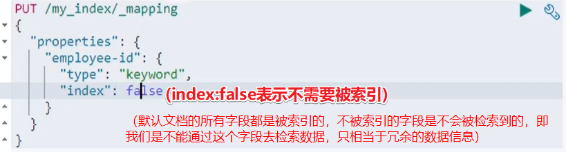

### 初步检索

可以通过向es的9200端口发送请求的方式对es的数据进行增删改查

##### _cat

- GET /_cat/nodes：查看所有节点
- GET /_cat/health：查看es健康状况
- GET /_cat/master：查看主节点
- GET /_cat/indices：查看所有索引（相当于mysql的`show databases;`命令）

##### 索引一个文档

- 携带id的保存：

  等同 mysql“保存一条记录”

``` json
请求：
PUT customer/external/1
{
    "name":"Jhon Doe"
}
# 说明：
1. PUT customer/external/1：在customer索引下的external类型下保存1数据（等同mysql“：在customer库中的external表保存1号数据”）；这里的1号数据是指这个es文档`{"name":"Jhon Doe"}`，（es的所有数据都是以json格式存储的）
2. PUT和POST请求方式都可以。前者必须指定id，PUT可新增可修改；post可以不指定id。更新操作会改变版本号version

# 《======================================================================================================》


响应 
{
       "index":"customer", # 表示这个文档在哪个索引下
       "_type":"external", # 表示这个文档在哪个类型下
       "id":"1", # 表示这个文档的id
       "_version":1, # 表示这个文档的版本
       "result":"created", # 本次请求操作的结果（因为是第一次保存，保存成功就叫created，第二次操作成功则为updated）
       "_shards":{ # 分片（集群的情况下考虑）
           "total":2,
           "successful":1,
           "failed":0,
       },
       "_seq_no":0,  
       "_primary_term":1,
   }
# 说明：
# 1. json中key带_的为元数据，反应了一些基本信息 
```


##### 查询文档

GET PUT customer/external/1


##### 更新文档

带_update的post更新会比对原有的数据，如果原有数据和将要修改成的数据是一致的，那么相应的结果就是："result":"noop",noop表示no operation没有操作，版本号不会往上加；如果不一致版本号就会往上加。而普通的post更新则都会改变


##### 删除文档&索引

es中没有删除类型的，只有删除索引 和 文档的


##### 批量操作API

（POST请求，该请求没办法在postman发起，只能在kibana的devtools尝试）


##### 进阶检索

；

第二种方式就是 Query DSL

；

##### query DSL


```json
# 基本查询格式（结构）
{
    QUERY_NAME:{
        ARGUMENT:VALUE,
        ARGUMENT:VALUE,...
    }
}
```


；


_source：返回部分字段

match：必须指定哪个属性匹配哪个值。当值是一个非字符串的时候，是精确查询，否则是一个模糊查询（全文检索）；使用match而不是match_all，就会发现max_score有值，每条查询出来的记录也会有_score的值，表示命中得分

match_phrase：不分词的匹配，模糊查询，相当于mysql的like。除此之外，我们还可以使用`字段.keyword`来避免分词，但是这个keyword是精确查询，相当于等于


复合查询bool：组合多种查询条件

`must`：必须满足

`must not`：必须不满足

`should`：满足最好，不满足也可以

；


过滤查询filter


term查询

全文检索的字段（字符字段）避免使用term，使用match比较好；精确查询（非字符字段）使用term比较好


aggregations：聚合查询


；


##### mapping映射

我们将一个文档存储在某一个索引的某一个类型下。而我们说的映射就是描述某个文档每一个字段的数据类型(数字/文本/位置坐标)


es不像MySQL建表的时定义某个字段的类型，它会在我们第一次保存数据的时候自动猜测数据的类型，帮我们自动确定

- 创建索引时手动指定索引的类型信息


- 对已存在索引**新增**字段映射信息

  ；

- 对已存在索引**更新**字段映射信息

  没办法更新。只能通过数据迁移的方式更改字段数据类型（把旧索引的数据迁移到已经更改了类型的新索引）。注：老版本是有type的，所以source那里要写明type

  ；

- 


先说说类型：


在6.0版本移除了 “类型”的说法


##### 分词

；


