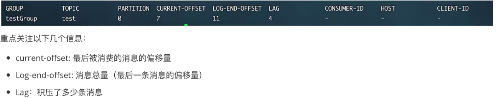
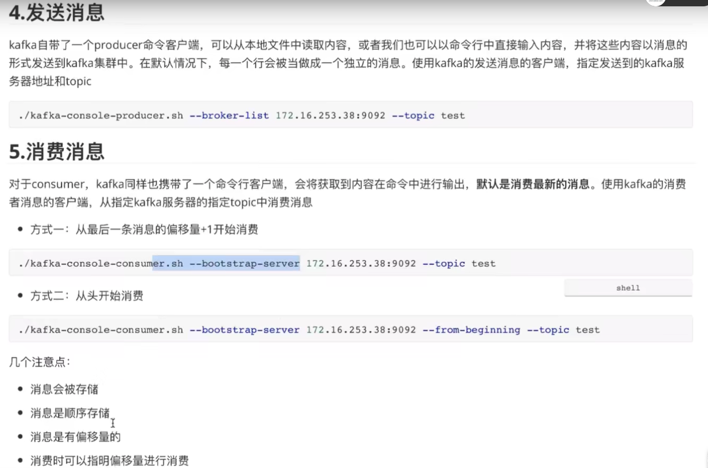
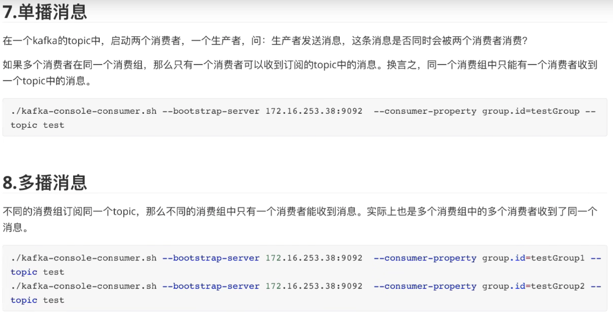
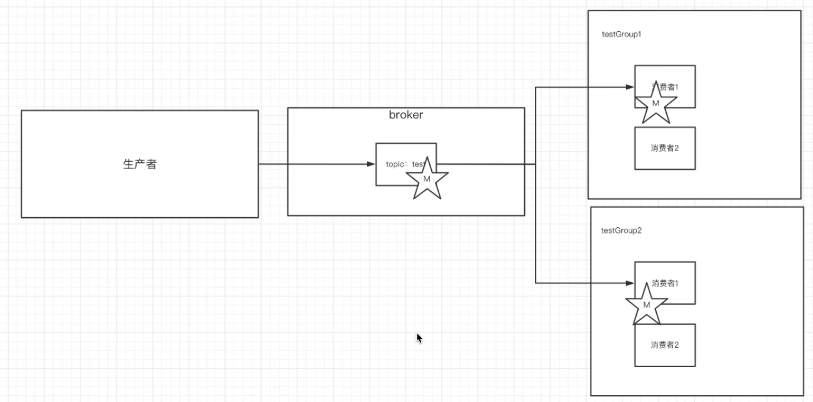
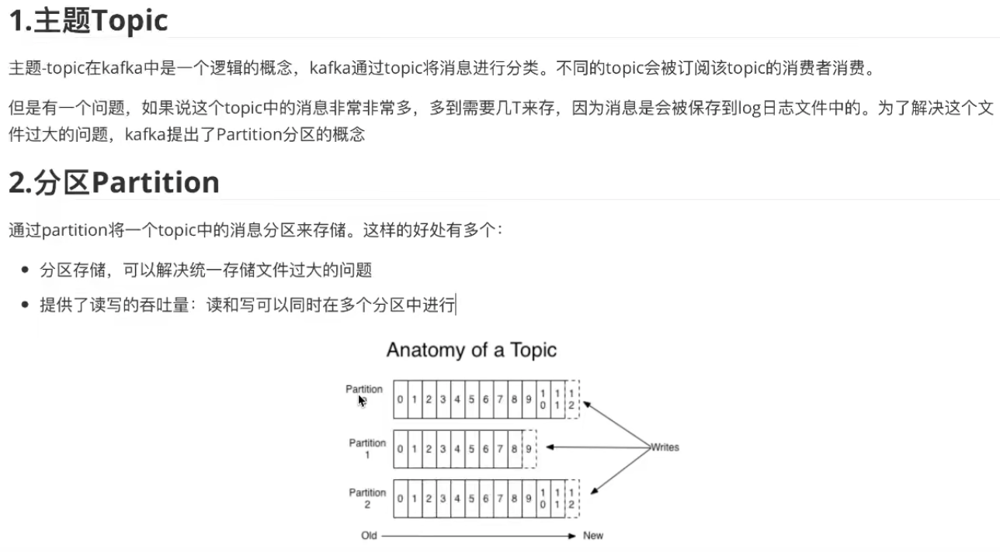
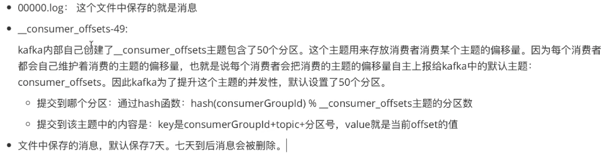
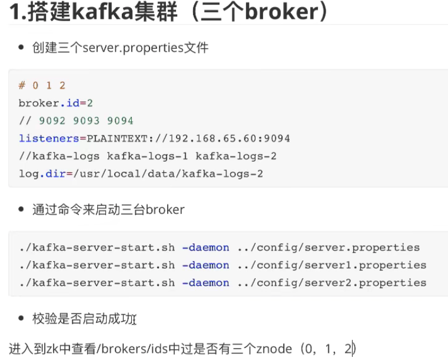
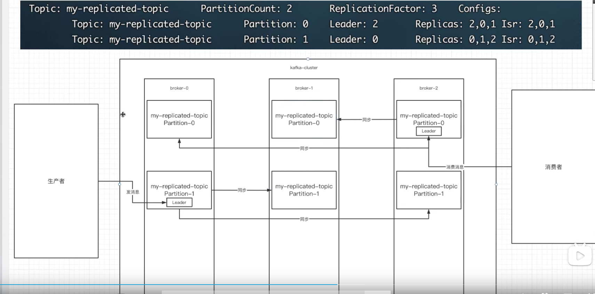

- 创建的主题(topic)保存在zookeeper中

  创建主题（`--replication-factor 1`指定副本数，` --partitions 2`指定分区数）

  ```shell
  ./kafka-topics.sh --create --zookeeper localhost:2181 --replication-factor 1 --partitions 2 --topic test
  ```

  查看当前zk中所有的主题

  ```shell
  ./kafka-topics.sh --list --zookeeper localhost:2181
  ```

  查看当前主题下有那些消费组

  ```shell
  ./kafka-comsumer-group.sh --bootstrap-server localhost:9092 --list
  ```

  查看消费组中的具体信息（如当前偏移量。最后一条消息的偏移量、堆积的消息数量）

  ```shell
  ./kafka-consumer-groups.sh --bootstrap-server localhost:9092 --describe --group testGroup
  ```

  


  

- 发送/消费消息（无论是发送还是消费消息，目标都是kafka的服务器）

- 消息的细节：

  - 生产者将消息发送给broker，broker会将消息保存在本地的日志文件中（`../kafka/data/kafka-logs/主题-分区/00000000.log`）
  - 消息的保存是有序的，通过偏移量offset来描述消息的有序性
  - 消费者消费消息时也是通过offset来描述当前要消费的那条消息的位置

- 单播和多播

  

  

- 分区和主题的概念

  

- kafka中消息日志文件中保存的内容

  

- kafka集群搭建

  

- 副本的概念

  副本是为了为主题中的分区创建多个备份，多个副本在kafka集群的的多个broker中，会有一个副本作为leader，其他事follower 

  leader和follower都是某个broker中的partition。

  - leader
    - kafka的读和写操作都发生在leader上。leader负责把数据同步给follower。当leader挂了，经过主从选举，从多个follower中选举产生一个新的leader
  - follower
    - 接受leader同步的数据
  - isr
    - 可以同步和已同步的节点会被存入到isr集合中。这里有一个细节：如果isr中的节点性能较差，会被踢出isr集合

- 概念总结：集群中有多个broker。创建主题时可以指明主题有多个分区（把消息 拆分到不同的分区中存储），可以为分区创建多个副本，不同的副本存放不同的broker里。


zookeeper查看注册的kafka节点

```shell
zkClient.cmd 
ls
ls /brokers
ls /brokers/ids
```

