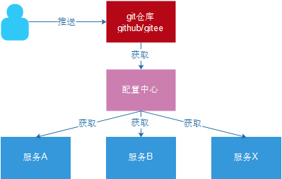
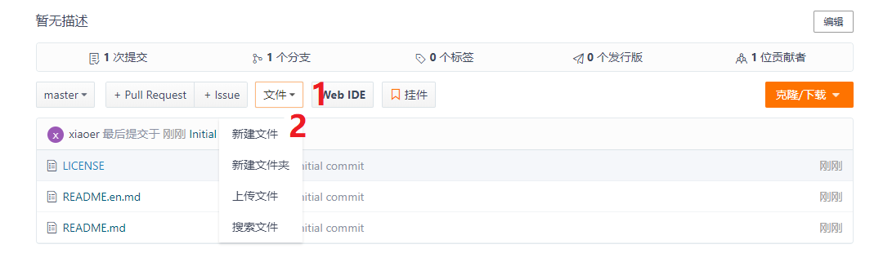

**如何出现Run DashBoard**


#  SpringCloud - ==伪装 Feign==应用

## 1.springClound-==Feign对请求的封装==

**目标**：

Feign的作用；使用Feign实现consumer-demo代码中调用服务

**问题**

在前面得学习中，我们使用了Ribbon得负载均衡能力，大大得简化了远程调用的代码：

```java
 public String getUser(@PathVariable("id")Long id){
 	 String url = "http://user-service/getuser/8";
	 return restTemplate.getForObject(url,String.class);
 }
```

如果学习到这里，你可能以后需要编写类似大量重复的代码，格式基本相同，无非参数不一致，有没有更优雅的方式，来对这些代码进行再次优化呢？

这就是接下来要学的Feign的功能了。

&nbsp;

**简介**

Feign也叫**伪装**：

Feign可以把Rest的请求进行隐藏**，**伪装成类似SpringMVC的Controller一样。


<strong style="font-size:28px;clor:green;background:#eee;padding:20px">Feign旨意：简化远程调用代码</strong>


简化了什么代码？

	服务的消费者在处理请求的时候：
	
		1、不用调用restTemplate，因为它已经被封装
	
		2、对于url地址，（1）不用再拼接url （2）原本对于url地址含有的不同参数的情况下，我们需要写大量不同的url地址，但现在不用了，只需在方法中提供参数就可以了

==**作用表现为：feign提供了：服务间互相调用的接口**==，调用服务的是偶只需要调用接口就可以了，无需在意细节。

项目主页：https://github.com/OpenFeign/feign


**作用对象工程**

consumer-demo

**快速入门**：

1. 导入启动器依赖；

2. 在启动类加入开启fegin支持；

3. 编写Feign客户端；

4. 编写一个处理器ConsumerFeignController，注入Feign客户端并使用；

5. 测试

   

Feign主要作用：自动根据参数拼接http请求地址。

- 在服务消费者添加启动器依赖；

```xml
<dependency>
    <groupId>org.springframework.cloud</groupId>
    <artifactId>spring-cloud-starter-openfeign</artifactId>
</dependency>
```

- 在启动类加入开启fegin支持

复合主键：

服务端注解：==@EnableFeignClients==

```java
package com.ithei.consumber.core;


import org.springframework.boot.autoconfigure.SpringBootApplication;
import org.springframework.cloud.client.discovery.EnableDiscoveryClient;
import org.springframework.cloud.netflix.hystrix.EnableHystrix;
import org.springframework.cloud.openfeign.EnableFeignClients;

import java.lang.annotation.*;

@Target(ElementType.TYPE)
@Retention(RetentionPolicy.RUNTIME)
@Documented
@SpringBootApplication
@EnableFeignClients //开启fegin支持
@EnableHystrix // 开启服务hystrix降级和熔断配置
@EnableDiscoveryClient // 开启eureka标记当前是eureka的客户端
public @interface SpringCloudApplication {
}

```

```java
package com.ithei.consumber;

import com.ithei.consumber.core.SpringCloudApplication;
import org.springframework.boot.SpringApplication;
import org.springframework.boot.autoconfigure.SpringBootApplication;
import org.springframework.cloud.client.discovery.EnableDiscoveryClient;
import org.springframework.cloud.client.loadbalancer.LoadBalanced;
import org.springframework.cloud.netflix.hystrix.EnableHystrix;
import org.springframework.context.annotation.Bean;
import org.springframework.web.client.RestTemplate;

@SpringCloudApplication //复合注解
public class ConsumberApplication {

    public static void main(String[] args){
        SpringApplication.run(ConsumberApplication.class);
    }

    @Bean
    @LoadBalanced
    public RestTemplate getRestTemplate(){
        return new RestTemplate();
    }
}

```

- **Feign客户端接口**：客户端注解==@FeignClient==

```java
package com.ithei.consumber.fegin;

import com.netflix.hystrix.contrib.javanica.annotation.HystrixCommand;
import org.springframework.cloud.openfeign.FeignClient;
import org.springframework.web.bind.annotation.GetMapping;
import org.springframework.web.bind.annotation.PathVariable;

import java.util.Map;

//最终，feign会拼接地址:http://user-service/getuser/P{id}
@FeignClient("user-service")//指定服务名
public interface UserFeignClient {
    @GetMapping("/getuser/{id}")//服务提供者控制器controller的地址
    public Map<String,Object> getUser4(@PathVariable("id")Integer id);
}

```

- 调用fegin的客户端代码执行请求

```java
package com.ithei.consumber.web;

import com.ithei.consumber.fegin.UserFeignClient;
import com.netflix.hystrix.contrib.javanica.annotation.DefaultProperties;
import com.netflix.hystrix.contrib.javanica.annotation.HystrixCommand;
import org.springframework.beans.factory.annotation.Autowired;
import org.springframework.web.bind.annotation.GetMapping;
import org.springframework.web.bind.annotation.PathVariable;
import org.springframework.web.bind.annotation.RestController;
import org.springframework.web.client.RestTemplate;

import java.util.HashMap;
import java.util.Map;

@RestController
@DefaultProperties(defaultFallback ="defaultCalback")
public class UserFeginController {


    @Autowired
    private UserFeignClient userFeignClient;

    @GetMapping("/getuser5/{id}")
    @HystrixCommand
    public Map<String,Object> getuser5(@PathVariable("id")Integer id){
        Map forObject = userFeignClient.getUser4(id);
        return forObject;
    }

    //  服务降级的回调方法
    public Map<String,Object> defaultCalback(){
        Map<String,Object> map = new HashMap<>();
        map.put("message","default服务忙， 请稍后，。。。。。" );
        map.put("status",409);
        return map;
    }

}
```

- 测试请求` http://localhost/getuser5/8 `

结果和原来是一样的


**小结**


## 2.  SpringCloud - ==Feign集成Ribbon==

**目标**：

可以配置Feign内置ribbon配置项

**概述**

1：==Fegin本身已经集成了Ribbon的依赖和自动配置==。==因此不需要额外引入依赖，也不需要再注册 RestTemplate 对象。==


测试代码如下：

1：把三个user-server 9091、9092、9093 启动起来。


2：修改服务提供方的业务代码，用日志的方式打印查看

```javascript
package com.itheima.springboothttpclient.web;

import com.itheima.springboothttpclient.pojo.User;
import com.itheima.springboothttpclient.user.IUserService;
import org.slf4j.Logger;
import org.slf4j.LoggerFactory;
import org.springframework.beans.factory.annotation.Autowired;
import org.springframework.beans.factory.annotation.Value;
import org.springframework.web.bind.annotation.GetMapping;
import org.springframework.web.bind.annotation.PathVariable;
import org.springframework.web.bind.annotation.RestController;

import java.util.Random;

@RestController
public class UserController {

    @Autowired
    private IUserService userService;

    private Logger log = LoggerFactory.getLogger(UserController.class);

    @Value("${port}")
    private int port;//通过value注解方式引入配置文件端口的值，来测试是哪个服务

    /**
     *  这里就是user-service服务暴露
     * @param id
     * @return
     */
    //todo http://localhost:9091/getuser/8
    @GetMapping("/getuser/{id}")
    public User getUser(@PathVariable("id")Integer id){
        log.info("当前访问的端口是：{}",port);
        return userService.getUser(id);
    }
}

```

3：然后在浏览器访问：` http://localhost/getuser5/8 `

查看日志可以看到fegin已经把ribbon集成带源代码中了。

```properties
第一次执行的效果
2019-10-30 22:37:05.196  INFO 6748 --- [nio-9093-exec-1] c.i.s.web.UserController                 : 当前访问的端口是：9091
2019-10-30 22:37:12.999  INFO 6748 --- [nio-9093-exec-2] c.i.s.web.UserController                 : 当前访问的端口是：9092
2019-10-30 22:37:13.478  INFO 6748 --- [nio-9093-exec-3] c.i.s.web.UserController                 : 当前访问的端口是：9093


第二次执行的效果
2019-10-30 22:37:13.975  INFO 6748 --- [nio-9093-exec-4] c.i.s.web.UserController                 : 当前访问的端口是：9091
2019-10-30 22:37:23.848  INFO 6748 --- [nio-9093-exec-8] c.i.s.web.UserController                 : 当前访问的端口是：9092
2019-10-30 22:37:23.848  INFO 6748 --- [nio-9093-exec-8] c.i.s.web.UserController                 : 当前访问的端口是：9093
```


**关于Ribbon其他配置** 

1：Fegin内置的ribbon默认设置了建立链接的超时时长，默认是500ms。以及读取超时时长，默认:1秒。如果超过拉取请求数据的时间超过500ms就回出现下面的错误： 


1：我们可以通过手动配置来修改这个超时时长：

```yml
ribbon:
    ReadTimeout: 2000 # 读取超时时长 请求超时默认:1秒	
    ConnectTimeout: 1000 # 建立链接的超时时长 默认是：500ms
```

ConnectTimeout 默认值是：500ms.

 （ps：ribbon内部有重试机制，一旦超时，会自动重新发起请求）


修改代码以测试：user-service的代码，让线程睡眠3s，模拟网络震荡

```java
package com.itheima.springboothttpclient.web;

import com.itheima.springboothttpclient.pojo.User;
import com.itheima.springboothttpclient.user.IUserService;
import org.slf4j.Logger;
import org.slf4j.LoggerFactory;
import org.springframework.beans.factory.annotation.Autowired;
import org.springframework.beans.factory.annotation.Value;
import org.springframework.web.bind.annotation.GetMapping;
import org.springframework.web.bind.annotation.PathVariable;
import org.springframework.web.bind.annotation.RestController;

import java.util.Random;

@RestController
public class UserController {

    @Autowired
    private IUserService userService;

    private Logger log = LoggerFactory.getLogger(UserController.class);

    @Value("${port}")
    private int port;

    /**
     *  这里就是user-service服务暴露
     * @param id
     * @return
     */
    //todo http://localhost:9091/getuser/8
    @GetMapping("/getuser/{id}")
    public User getUser(@PathVariable("id")Integer id){
        try {
            Thread.sleep(new Random().nextInt(3000));
        }catch (Exception ex){
            ex.printStackTrace();
        }
        log.info("当前访问的端口是：{}",port);
        return userService.getUser(id);
    }
}

```


2：然后再配置ribbon的连接超时时间为4000ms，大于3s，查看效果

```yml
ribbon:
  ReadTimeout: 2000 # 读取超时时长 请求超时默认:1秒
  ConnectTimeout: 4000 # 建立链接的超时时长 默认是：500ms
```

现在连接的时间`ConnectTimeout`大于上面user-service的休眠时间3秒。fegin的ribbon能够放行通过，但是仍然有可能得不到正确的服务。因为睡眠时间虽然没有超过`ConnectTimeout`设定的时间，但是还有读取时间，若读取时间大于1s，仍然不能成功获得服务

2：运行查看效果


3：修改服务消费者的application.yml 添加==**重试**配置==：

```yml
ribbon:
    ConnectTimeout: 1000 # ribbon连接超时时长
    ReadTimeout: 2000 # ribbon读取超时时常
    MaxAutoRetries: 0 # 当前服务的重试次数（不建议重试，除非是核心业务）
    MaxAutoRetriesNextServer: 0 # 切换服务重试次数
    OkToRetryOnAllOperations: false # 是否对所有的请求方式都重试
```

重新给UserService的方法设置上线程沉睡时间2秒可以测试上述配置


## 3.  SpringCloud - ==Feign集成Hystrix】==

**目标**：

可以配置Feign的Hystrix熔断的Fallback配置

**分析**：

- 负载均衡
- 服务熔断
- 请求压缩
- 日志级别都可以通过配置项在Feign中开启使用。

==Feign默认也有对Hystrix的集成；只不过，默认情况下是关闭的。需要通过下面的参数来开启==；


1：修改 服务消费者的application.yml 添加如下配置：

```yml
# Feign默认也有对Hystrix的集成；只不过，默认情况下是关闭的。需要通过下面的参数来开启
# 开启Feign的熔断功能 默认是false .默认是1秒钟服务降级
feign:
  hystrix:
    enabled: true 
```

如果时间已经超过1秒了，所以就会出现下面的错误：


Feign中的服务降级配置（Fallback）不像Ribbon中那样简单了。如何用fegin结合hystrix进行服务降级呢？步骤如下：

0)：打开fegin对hystrinx的支持

1)：首先，要定义一个类，实现刚才编写的UserFeignClient，作为fallback的处理类

2)：修改 consumer-demo\src\main\resources\application.yml 添加如下配置

3) :  注册`UserFeignClientHystrix `到 `UserFeignClient`定义类

4):  在`UserFeginController`中调用`UserFeignClient`

5):  测试


1：修改 服务消费者的application.yml 添加如下配置：

```yaml
# Feign默认也有对Hystrix的集成；只不过，默认情况下是关闭的。需要通过下面的参数来开启
# 开启Feign的熔断功能 默认是false .默认是1秒钟服务降级
feign:
  hystrix:
    enabled: true
```

==注意：如果ribbon配置的超时时间， hystix的超时时间会被覆盖，**rbbion的优先级高于hystix**==

1）首先，要==定义一个 `UserFeignClientHystrix `类，作为fallback的处理类，必须要**实现implements**第一节编写的UserFeignClient==，

```java
package com.ithei.consumber.feign;

import org.springframework.cloud.openfeign.FeignClient;
import org.springframework.stereotype.Component;
import org.springframework.web.bind.annotation.GetMapping;
import org.springframework.web.bind.annotation.PathVariable;

import java.util.HashMap;
import java.util.Map;

@Component
public class UserFeignClientHystix implements UserFeignClient{

    /**
     * 为你量身定制的降级处理
     * @param id
     * @return
     */
    @Override
    public Map<String,Object> getUser(Integer id){
       Map<String,Object> map = new HashMap<>();
       map.put("message","feign hystix ====用户你好："+id+"，服务忙， 请稍后，。。。。。" );
       map.put("status",409);
       return map;
    }

}

```

2：注册`UserFeignClientHystrix `到 `UserFeignClient`定义类如下：

	==@FeignClient注解的fallback属性==

```java
package com.ithei.consumber.fegin;

import com.netflix.hystrix.contrib.javanica.annotation.HystrixCommand;
import org.springframework.cloud.openfeign.FeignClient;
import org.springframework.web.bind.annotation.GetMapping;
import org.springframework.web.bind.annotation.PathVariable;

import java.util.Map;

// 定义伪装类
@FeignClient(value = "user-service",fallback = UserFeignClientHystix.class)
public interface UserFeignClient {

    @GetMapping("/getuser/{id}")
    public Map<String,Object> getuser5(@PathVariable("id")Integer id);

}

```

3：在`UserFeginController`中调用`UserFeignClient`

```java
package com.ithei.consumber.web;

import com.ithei.consumber.feign.UserFeignClient;
import org.springframework.beans.factory.annotation.Autowired;
import org.springframework.web.bind.annotation.GetMapping;
import org.springframework.web.bind.annotation.PathVariable;
import org.springframework.web.bind.annotation.RestController;

import java.util.Map;

@RestController
public class UserFeignController {


    //fegin的接口进行注入
    @Autowired
    private UserFeignClient userFeignClient;


    @GetMapping("/getuser5/{id}")
    public Map<String,Object> getuser5(@PathVariable("id")Integer id){
        return userFeignClient.getUser(id);
    }

}
```

4：测试

测试地址：` http://localhost/getuser5/8 `


降级成功。


**完整配置文件**

```yml
# 服务的端口
server:
  port: 80


# 配置日志
logging:
  level:
    com.ithei: debug

#  服务的名字
spring:
  application:
    name: comsumber-demo-service

# 注册到eureka中
eureka:
  client:
    service-url:
      defaultZone: http://localhost:10086/eureka
    # 服务拉取
    fetch-registry: true
    # 服务注册
    register-with-eureka: true

# 启动用户服务的负载均衡算法，改为随机策略
#user-service:
#  ribbon:
#    NFLoadBalancerRuleClassName: com.netflix.loadbalancer.RandomRule

ribbon:
  ConnectTimeout: 1000 # 连接超时时长
  ReadTimeout: 3000 # 数据通信超时时长
  MaxAutoRetries: 0 # 当前服务器的重试次数
  MaxAutoRetriesNextServer: 0 # 重试多少次服务
  OkToRetryOnAllOperations: false # 是否对所有的请求方式都重试

# 开启Feign的熔断功能 默认是false .默认是1秒钟服务降级
feign:
  hystrix:
    enabled: true

# 启动hystrix的超时设置，因为默认超时是：1秒，在实际的生产中，不要去覆盖.
hystrix:
  command:
    default:
      execution:
        isolation:
          thread:
            #  降级在某种程度就因为eureka会自我保护，可能就把哪些坏的服务器保留在eureka服务中。
            timeoutInMilliseconds: 2000
      circuitBreaker:
        errorThresholdPercentage: 50 # 触发熔断错误比例阈值，默认值50% 也就是说requestVolumeThreshold 出现错误得次数超过5层就会激活熔断
        sleepWindowInMilliseconds: 10000 # 熔断后休眠时长，默认值5秒
        requestVolumeThreshold: 10 # 熔断触发最小请求次数，默认值是20
```


## 4.  SpringCloud - Feign熔断Hystrix 日志级别（了解）

**目标**

使用日志完成对fegin的打印分析

[https://blog.csdn.net/qq_41211642/article/details/104851537?utm_medium=distribute.pc_aggpage_search_result.none-task-blog-2~all~first_rank_v2~rank_v25-1-104851537.nonecase&utm_term=feign%E5%BC%80%E5%90%AF%E6%97%A5%E5%BF%97%E7%9B%91%E6%8E%A7](https://blog.csdn.net/qq_41211642/article/details/104851537?utm_medium=distribute.pc_aggpage_search_result.none-task-blog-2~all~first_rank_v2~rank_v25-1-104851537.nonecase&utm_term=feign开启日志监控)

**分析**

前面讲过，通过 logging.level.xx=debug 来设置日志级别。**然而前面的这种日志对Fegin客户端而言不会产生记录日志的效果**。因为@FeignClient 注解修改的客户端在被代理时，都会创建一个新的Fegin.Logger实例。**我们需要额外指定这个日志的级别**。

**步骤**

1）在服务消费者的application.yml配置文件中设置com.itheima包下的日志级别都为 debug

```yml
# 配置日志
logging:
  level:
    com.itheima: debug
```

2）在 consumer-demo ==编写FeignConfig配置类==，定义日志级别

**对于Logger类注意要导入Feign的包**

```java
package com.ithei.consumber.fegin;

import feign.Logger;
import org.springframework.context.annotation.Bean;
import org.springframework.context.annotation.Configuration;

@Configuration
public class FeignLogConfig {
    @Bean
    public Logger.Level feignLoggerLevel() {
        //记录所有请求和响应的明细，包括头信息、请求体、元数据
        // NONE 不记录任何信息，默认值
        // BASIC 记录请求方法，请求URL，状态码和用时
        // HEADERS 在BASIC的基础上在记录一些常用信息
        // FULL 记录请求和响应的全部内容。
        return Logger.Level.FULL;
    }
}
```


>这里指定的Level级别是FULL，Feign支持4种级别：
>1：NONE：不记录任何日志信息，这是默认值。
>2：BASIC：仅记录请求的方法，URL以及响应状态码和执行时间
>3：HEADERS：在BASIC的基础上，额外记录了请求和响应的头信息
>4：FULL：记录所有请求和响应的明细，包括头信息、请求体、元数据。


3）在 consumer-demo 的 UserClient 接口类上的@FeignClient注解中指定配置类**（这一步其实可以省略，但是指定了就会更加明确）**

==注解@FeignClient的configuration属性==

```java
package com.ithei.consumber.fegin;

import com.netflix.hystrix.contrib.javanica.annotation.HystrixCommand;
import org.springframework.cloud.openfeign.FeignClient;
import org.springframework.web.bind.annotation.GetMapping;
import org.springframework.web.bind.annotation.PathVariable;

import java.util.Map;

// 定义伪装类
@FeignClient(value = "user-service",fallback = UserFeignClientHystrix.class,
configuration = FeignLogConfig.class)
public interface UserFeignClient {

    @GetMapping("/getuser/{id}")
    public Map<String,Object> getuser5(@PathVariable("id")Integer id);

}

```


4）重启项目，访问：http://localhost:8080/cf/8 ；即可看到每次访问的日志


# 第六部分：SpringCloud - ==网关 GateWay==


**目标**：

学习和掌握getway网关的配置，路由控制。

**迁移到Spring Cloud Gateway**

Spring Cloud Netflix Zuul是由Netflix开源的API网关，**在微服务架构下，网关作为对外的门户，实现动态路由、监控、授权、安全、调度等功能**。


==有两种网关技术：**ZUUL**和**Gateway**==

Zuul基于servlet 2.5 IO（使用3.x），使用阻塞API 。 它不支持任何长连接，如websockets。

而Gateway建立在Spring Framework 5，Project Reactor和Spring Boot 2之上，使用非阻塞API NIO。 比较完美地支持异步非阻塞编程，先前的Spring系大多是同步阻塞的编程模式，使用thread-per-request处理模型。Gateway 中Websockets得到支持，并且由于它与Spring紧密集成，所以将会是一个更好的开发体验。

搭建网关服务工程测试网关服务作用,以及路由的构成。实现的主要功能如下：路由转发、权重路由、断路器、限流、鉴权和黑白名单等。本文基于主要实现如下的三方面功能：

- 路由断言

- 过滤器（包括全局过滤器，如断路器、限流等）

- 全局鉴权 

- 路由配置，路由转发

- CORS 跨域

## Gateway：url地址的==匹配 + 路由==


###  5. Spring Cloud  GateWay --==路由的面向地址==--==静态路由==


**目标**

使用gateway完成路由的转发和配置


**组成**

 路由信息的组成： routes

1：由一个ID、

2：一个目的URI、

3：一组断言工厂、

4：一组Filter组成。

如果路由断言为真，说明请求URL和配置路由匹配。


**分析**：

需求：通过网关系统heima-gateway将包含有 /user 的请求 路由到 http://127.0.0.1:9091/getuser/用户id 

实现步骤：

1：创建工程

2：添加启动器依赖

3：编写启动引导类和配置文件；

4：修改配置文件，设置路由信息

5：启动测试  http://127.0.0.1:10010/getuser/8 --> http://127.0.0.1:9091/getuser/8


**1：创建工程**


**2：添加启动器依赖**

```xml
 <!--gateway 依赖-->
<dependency>
    <groupId>org.springframework.cloud</groupId>
    <artifactId>spring-cloud-starter-gateway</artifactId>
</dependency>

<!--eureka client依赖-->
<dependency>
    <groupId>org.springframework.cloud</groupId>
    <artifactId>spring-cloud-starter-netflix-eureka-client</artifactId>
</dependency>
```

**3：编写启动引导类和配置文件；**

```java
package com.itheima.gateway;

import org.springframework.boot.SpringApplication;
import org.springframework.boot.autoconfigure.SpringBootApplication;
import org.springframework.cloud.client.discovery.EnableDiscoveryClient;

@SpringBootApplication
@EnableDiscoveryClient // 开启eureka的服务注解
public class ZullGatewayApplication {

    public static void main(String[] args){
        SpringApplication.run(ZullGatewayApplication.class);
    }

}
```

**4：修改配置文件，设置路由信息；**

对于该配置，==**实际上就是一个地址匹配 + 地址路由的过程**==：

首先，我们先输入的是网关的地址： http://127.0.0.1:10010/getuser/8

然后网关就通过地址路由的功能，**若符合地址映射规则**，最终地址转换为服务的地址： http://127.0.0.1:9091/getuser/8

```yml
# 服务端口
server:
  port: 10010

# 服务配置
spring:
  application:
    name: api-gateway
  cloud:
    # 网关配置
    gateway:
      routes: #routes的数据结构是一个map集合
        - id: user-service-route # 路由id，用于标识路由，要保证唯一，建议命名跟格式为：服务名 + route
          uri: http://127.0.0.1:9091 # uri是user-service服务的ip+端口地址
          predicates: #predicates的数据结构是一个数组，是路由断言，也就是【地址映射规则】
            - Path=/getuser/** # path是user-service服务的除了ip和端口的其他具体地址，用于地址匹配

#  注册到eureka服务中
eureka:
  client:
    service-url:
      defaultZone: http://localhost:10086/eureka

```


5：启动测试  

访问的路径需要加上配置规则的映射路径，我们访问： http://127.0.0.1:10010/getuser/8  即可，跳转到对应的服务中，做到统一管理的目的。


### 6. Spring Cloud Gateway - ==路由的面向服务==--==动态路由==（==负载分流==）

**目标**：

使用在eureka注册的服务作为路由地址


**问题分析**：


==如果同一服务有多个实例的话，如果将路由服务地址写死明显是不合理的（例如在本机user-service服务由9091，9092，9093）。正确的来说，我们应该根据服务的名称，去Eureka注册中心查找 服务对应的所有实例列表，然后进行动态路由！==


**解决方案**

1：修改映射配置，通过服务名称获取

因为已经配置了Eureka客户端，可以从Eureka获取服务的地址信息。
修改 heima-gateway\src\main\resources\application.yml 文件如下：

```yml
server:
  port: 10010
spring:
  application:
    name: api-gateway
  cloud:
    gateway:
      routes:
        # 路由id，可以任意
        - id: user-service-route
          #之前做法
          #uri: http://127.0.0.1:9091
          # 代理的服务地址, lb表示从eureka中获取具体的服务列表 lb是loadbalance(负载分流)的简写
          uri: lb://user-service  # 注意这里的user-service就必须保持eureka注册的用户服务名一致。
          # 路由断言： 可以匹配映射路径,在一些特殊领域建议是配置具体的，而不是使用/** 。
          # /**代表里面user-service 中所有的方法都可以通过网关去获取，如果不想请配置具体的。
          predicates:
            - Path=/getuser/**
eureka:
  client:
    service-url:
      defaultZone: http://127.0.0.1:10086/eureka
  instance:
    prefer-ip-address: true
    # ip地址
    ip-address: 127.0.0.1
    # 获取服务地址列表间隔时间，默认30秒
    registry-fetch-interval-seconds: 20
```

把原来写死得路径用：`lb://服务名称`来定义和寻找服务。

2：测的方式，分别启动两个用户服务。启动所有的用户服务


在eureka中的配置效果


3：结果就是：默认的负载均衡策略是：轮询。


**小结**：

面向服务的路由；只需要在配置文件中指定路由路径类似： `lb://user-service`

> lb 之后编写的服务名必须要在eureka中注册才能使用


## Gateway：url地址的==规范 + 保密==


### 7.  Spring Cloud Gateway - 路由对请求==地址前缀处理==

**目标**：

可以对请求到网关服务的地址添加或去除前缀

**问题**：

​	开发中我们希望业务划分的更清晰，希望请求地址更有可读性，更具有规范性，通常会再请求地址上增加多一个前缀地址；有时我们希望能隐藏内部的地址目录结构，我们通常希望在浏览器的请求地址上减少对地址的暴露。**但与此同时又希望客户端的请求地址与微服务的服务地址不一致的时候也能匹配上**，那么我们就可以==通过配置**路径过滤器**分别对上述两种情况**在服务器内部**进行路径前缀的【去除】和【添加】==。

**分析**：

**==规范：去除前缀==：多就减 -- StripPrefix** 

目标：在gateway中可以通过配置路由的过滤器StripPrefix，实现映射路径中地址的去除，**去除的起点是以端口号为起点**。例子：


1：修改 heima-gateway\src\main\resources\application.yml 文件：

```yml
# 服务端口
server:
  port: 10010

# 服务配置
spring:
  application:
    name: api-gateway
  cloud:
    # 网关配置
    gateway:
      routes:
        # 路由id，可以任意
        - id: user-service-route
          # 代理的服务地址
          #uri: http://127.0.0.1:9091
          # 代理的服务地址, lb表示从eureka中获取具体的服务列表 lb是loadbalance的简写
          uri: lb://user-service # 注意这里的user-service就必须保持eureka注册的用户服务名一致。
          # 路由断言： 可以匹配映射路径,在一些特殊领域建议是配置具体的，而不是使用/** 。
          # /**代表里面user-service 中所有的方法都可以通过网关去获取，如果不想请配置具体的。
          # 路由断言： 可以匹配映射路径
          predicates:
            - Path=/api/getuser/**
          # 配置拦截器
          filters:
            #- PrefixPath=/getuser
            # 表示过滤去除掉1个路径，2表示过滤去除掉两个路径，以此类推（去除1个就是把/api这层去掉）
            - StripPrefix=1
# eureka注册
eureka:
  client:
    service-url:
      defaultZone: http://127.0.0.1:10086/eureka
```

2：测试访问：` http://localhost:10010/api/getuser/8 `


如果对StripPrefix不理解可以参考下面：


**==保密：添加前缀== --PrefixPath-- 少就补**

在gateway中可以通过配置路由的过滤器PrefixPath，实现映射路径中地址的添加，**添加的起点是：以端口号为起点开始添加**；例子：

需要访问的提供服务的地址：http://127.0.0.1:9091/getuser/8

- 添加前缀：对请求地址添加前缀路径之后再作为代理的服务地址；

- http://127.0.0.1:10010/8 --> http://127.0.0.1:9091/getuser/8 添加前缀路径/getuser

  为了保密路径而隐藏。也就告诉你在内部转发的时候会自加上PrefixPath，这里可以省去一下细节。==

```yml
# 服务端口
server:
  port: 10010

# 服务配置
spring:
  application:
    name: api-gateway
  cloud:
    # 网关配置
    gateway:
      routes:
        # 路由id，可以任意
        - id: user-service-route
          # 代理的服务地址
          #uri: http://127.0.0.1:9091
          # 代理的服务地址, lb表示从eureka中获取具体的服务列表 lb是loadbalance的简写
          uri: lb://user-service #注意这里的user-service就必须保持eureka注册的用户服务名一致。
          # 路由断言： 可以匹配映射路径,在一些特殊领域建议是配置具体的，而不是使用/** 。
          # /**代表里面user-service 中所有的方法都可以通过网关去获取，如果不想请配置具体的。
          # 路由断言： 可以匹配映射路径
          predicates:
            - Path=/**
          # 配置拦截器
          filters:
            - PrefixPath=/getuser

# eureka注册
eureka:
  client:
    service-url:
      defaultZone: http://127.0.0.1:10086/eureka
```


## Gateway：路由的原理：==过滤器==

### 8. Spring Cloud Gateway - ==过滤器的执行生命周期==

**目标**

掌握和了解gateway的执行生命周期。引出自定义过滤器的意义和价值以及使用场景

**概述**

Spring Cloud Gateway 的 Filter 的生命周期也类似day46的Spring MVC的拦截器的两个：==“pre”== 和 ==“post”==方法。“pre”和 “post” 分别会在请求被执行前调用和被执行后调用。

类似于 

**参考代码**

```java
package com.itheima.springboothttpclient;

import org.springframework.web.servlet.HandlerInterceptor;
import org.springframework.web.servlet.ModelAndView;

import javax.servlet.http.HttpServletRequest;
import javax.servlet.http.HttpServletResponse;

public class LoginInterceptor implements HandlerInterceptor {

    @Override
    public boolean preHandle(HttpServletRequest request, HttpServletResponse response, Object handler) throws Exception {
        return false;
    }

    @Override
    public void postHandle(HttpServletRequest request, HttpServletResponse response, Object handler, ModelAndView modelAndView) throws Exception {

    }

    @Override
    public void afterCompletion(HttpServletRequest request, HttpServletResponse response, Object handler, Exception ex) throws Exception {

    }
}

```


**图解**


这里的 pre 和 post 可以通过过滤器的 GatewayFilterChain 执行filter方法前后来实现。

**==使用场景==**

常见的应用场景如下：
1：请求鉴权：一般 GatewayFilterChain 执行filter方法前，如果发现没有访问权限，直接就返回空。
2：异常处理：一般 GatewayFilterChain 执行filter方法后，记录异常并返回。
3：服务调用时长统计： GatewayFilterChain 执行filter方法前后根据时间统计。


### 9. Spring Cloud Gateway - ==过滤器==简介和配置==默认过滤器==

**目标**：

Gateway默认过滤器的用法和过滤器类型

**简介**

Gateway作为网关的其中一个重要功能，就是实现请求的鉴权。而这个动作往往是通过网关提供的过滤器来实现的。前面的 路由前缀 章节中的功能也是使用过滤器实现的。

==默认过滤器==实际上就是**Gateway自带的过滤器**

Gateway默认过滤器有几十个，常见默认过滤器有：


详细的说明在：官网链接   https://cloud.spring.io/spring-cloud-static/spring-cloud-gateway/2.1.1.RELEASE/single/spring-cloud-gateway.html#_gatewayfilter_factorie

==默认过滤器是在Gateway服务的application.yml配置文件上实现的==

若默认过滤器从作用范围划分，，有两种类型的过滤器：

1、**局部过滤器**：通过 spring.cloud.gateway.routes.filters 配置在具体路由下，只作用在当前路由上；

2、**全局过滤器**：通过spring.cloud.gateway.default-filters 配置，会对所有路由生效；

**步骤**

1：添加局部过滤器和全局过滤器

2：修改`user-service`代码，增加获取参数。

3：访问` http://localhost:10010/api/getuser/8 `测试


1：添加局部过滤器和全局过滤器

```yml
# 服务端口
server:
  port: 10010

# 服务配置
spring:
  application:
    name: api-gateway
  cloud:
    # 网关配置
    gateway:
      routes:
        # 路由id，可以任意
        - id: user-service-route
          # 代理的服务地址
          #uri: http://127.0.0.1:9091
          # 代理的服务地址, lb表示从eureka中获取具体的服务列表 lb是loadbalance的简写
          uri: lb://user-service # 注意这里的user-service就必须保持eureka注册的用户服务名一致。
          # 路由断言： 可以匹配映射路径,在一些特殊领域建议是配置具体的，而不是使用/** 。
          # /**代表里面user-service 中所有的方法都可以通过网关去获取，如果不想请配置具体的。
          # 路由断言： 可以匹配映射路径
          predicates:
            - Path=/api/getuser/**
          # 局部过滤器
          filters:
            #- PrefixPath=/getuser
            # 表示过滤1个路径，2表示两个路径，以此类推 也就是把/api这层去掉
            - StripPrefix=1
            # 这里是局部的，给匹配到的每个路由/api/getuser/xxxx地址增加参数username=zhagnsan
            - AddRequestParameter=username, zhangsan
            - AddRequestParameter=age, 32
      #全局过滤器
      default-filters: 
        # 响应头过滤器，对输出的响应设置其头部属性名称为：X-Response-Default-MyName，值为：itcast；如果有多个参数多则重写一行设置不同的参数
        - AddResponseHeader=X-Response-Default-MyName, itcast
        - AddResponseHeader=X-Response-Default-TOKEN, itcasttoken
        - AddRequestParameter=token, tokenvaluexxxx
# eureka注册
eureka:
  client:
    service-url:
      defaultZone: http://127.0.0.1:10086/eureka
```

2：放入请求参数放入到请求体中 `  - AddRequestParameter=foo, bar`。在服务的提供放user-service中，代码修改如下：

```java
package com.itheima.springboothttpclient.web;

import com.itheima.springboothttpclient.pojo.User;
import com.itheima.springboothttpclient.user.IUserService;
import org.slf4j.Logger;
import org.slf4j.LoggerFactory;
import org.springframework.beans.factory.annotation.Autowired;
import org.springframework.beans.factory.annotation.Value;
import org.springframework.web.bind.annotation.GetMapping;
import org.springframework.web.bind.annotation.PathVariable;
import org.springframework.web.bind.annotation.RestController;

import javax.servlet.http.HttpServletRequest;
import java.util.Random;

@RestController
public class UserController {

    @Autowired
    private IUserService userService;

    private Logger log = LoggerFactory.getLogger(UserController.class);

    @Value("${port}")
    private int port;

    /**
     *  这里就是user-service服务暴露
     * @param id
     * @return
     */
    //todo http://localhost:9091/getuser/8
    @GetMapping("/getuser/{id}")
    public User getUser(@PathVariable("id")Integer id, HttpServletRequest request){
        /*try {
            Thread.sleep(new Random().nextInt(3000));
        }catch (Exception ex){
            ex.printStackTrace();
        }*/
        // 全局过滤器的参数
        System.out.println("default filters 的参数："+request.getParameter("token"));
        //局部参数
        System.out.println("1：局部的参数："+request.getParameter("username"));
        System.out.println("2：局部的参数："+request.getParameter("age"));
        log.info("当前访问的端口是：{}",port);
        return userService.getUser(id);
    }
}

```

运行结果：`http://localhost:10010/api/getuser/8` 如下：

1：打印全局参数和局部参数如下


2：测试响应头如下。


### 10. Spring Cloud Gateway - ==自定义【局部】过滤器==

**需求**：

在过滤器（MyParamGatewayFilterFactory）中将http://localhost:10010/api/getuser/8?name=itcast中的参数name的值获取到并输出到控制台；同时要求往后的业务中参数名是可变的，也就是不一定每次都是name：这就需要可以通过配置过滤器的时候做到配置参数名。

实现：

按照默认过滤器编写并配置一个自定义局部过滤器，**该自定义过滤器可以通过过滤得到配置文件中的参数名称，然后再获取请求的参数值**

==**实质**：这种Gateway自定义过滤器的实质是对请求地址的参数进行匹配，符合条件的就“过滤”，具体怎么过滤，由自己定义==。（本案例的过滤方式是打印输出至控制台）

实现步骤：

1. 配置过滤器；
2. 编写过滤器；
3. 测试

**==局部过滤器类的【命名格式】==**

**xxxxxx+GatewayFilterFactory**

**步骤**：

1：自定义过滤器类 `MyParamGatewayFilterFactory` 继承`AbstractGatewayFilterFactory<MyParamGatewayFilterFactory.Config>`

2：定义静态内部类方法Config

3：覆盖网关方法、构造方法

4：测试获取相关信息查看打印


- 自定义局部过滤器类要==继承=`AbstractGatewayFilterFactory<MyParamGatewayFilterFactory.Config>`==

```java
package com.itheima.filter;

import org.springframework.cloud.gateway.filter.GatewayFilter;
import org.springframework.cloud.gateway.filter.GatewayFilterChain;
import org.springframework.cloud.gateway.filter.factory.AbstractGatewayFilterFactory;
import org.springframework.http.server.reactive.ServerHttpRequest;
import org.springframework.stereotype.Component;
import org.springframework.web.server.ServerWebExchange;
import reactor.core.publisher.Mono;

import java.util.Arrays;
import java.util.List;

@Component
public class MyParamGatewayFilterFactory extends AbstractGatewayFilterFactory<MyParamGatewayFilterFactory.Config> {

    //构造函数一定要有
    public MyParamGatewayFilterFactory() {
        super(Config.class);
    }

    //1:定义返回参数的名称，其实是用来获取请求地址的参数部分
    //如果我请求的地址是： http://localhost:10010/api/getuser/8?name=itcast&age=32
    //那么param获取的就是：name=itcast&age=32
    static final String PARAM_NAME = "param";

    // 这个方法要重写
    public List<String> shortcutFieldOrder() {
        List<String> strings = Arrays.asList(PARAM_NAME);
        for (String string : strings) {
            System.out.println("==================>"+ string);
        }
        return Arrays.asList(PARAM_NAME);//把请求的参数部分转换成集合
    }

    //这个方法也要重写，且此方法是我们拦截器处理请求的地方
    @Override
    public GatewayFilter apply(Config config) {
        // 返回网关过滤器
        return new GatewayFilter() {
            @Override
            public Mono<Void> filter(ServerWebExchange exchange, GatewayFilterChain chain) {
                // http://localhost:10010/api/getuser/8?name=itcast   config.param ==> name
                //获取请求参数中param对应的参数名 的参数值
                ServerHttpRequest request = exchange.getRequest();
                // 判断我当前的请求对象中是否存在参数name和age.
                if (request.getQueryParams().containsKey(config.param)) {
                    // 存在的话就打印name和age的信息
                    for (String value : request.getQueryParams().get(config.param)) {
                        System.out.println("------------局部过滤器--------"+config.param +" = "+value+"------");
                    }
                }
                return chain.filter(exchange);
            }
        };
    }


    //静态配置类，用于指定配置文件中配置参数时候使用的参数名
    public static class Config{
        //对应在配置文件中配置过滤器的时候指定的参数名
        private String param;

        //下面的两个方法可以快速生成：右键--->generate--->getterAndSetter
        public String getParam() {
            return param;
        }

        public void setParam(String MyParam) {
            System.out.println("======================>"+MyParam);
            this.param = MyParam;
        }
    }
}
```

- 注册过滤器

```yml
# 服务端口
server:
  port: 10010

# 服务配置
spring:
  application:
    name: api-gateway
  cloud:
    # 网关配置
    gateway:
      routes:
        # 路由id，可以任意
        - id: user-service-route
          # 代理的服务地址
          #uri: http://127.0.0.1:9091
          # 代理的服务地址, lb表示从eureka中获取具体的服务列表 lb是loadbalance的简写
          uri: lb://user-service # 注意这里的user-service就必须保持eureka注册的用户服务名一致。
          # 路由断言： 可以匹配映射路径,在一些特殊领域建议是配置具体的，而不是使用/** 。
          # /**代表里面user-service 中所有的方法都可以通过网关去获取，如果不想请配置具体的。
          # 路由断言： 可以匹配映射路径
          predicates:
            - Path=/api/getuser/**
          # 配置拦截器
          filters:
            #- PrefixPath=/getuser
            # 表示过滤1个路径，2表示两个路径，以此类推 也就是把/api这层去掉
            - StripPrefix=1
            # 这里是局部的，给每个路由/api/getuser/xxxx地址增加参数username=zhagnsan
            - AddRequestParameter=username, zhangsan
            - AddRequestParameter=age, 32
            # 自定义局部过滤器，自定义过滤器的命名应该为：***GatewayFilterFactory ,此时这里的--后面为***；这里的name和age是参数的名称，参数可以赋值也可以不赋值，一般由浏览器赋值
            - MyParam=name
            - MyParam=age
      #全局过滤器
      default-filters:
        # 响应头过滤器，对输出的响应设置其头部属性名称为X-Response-Default-MyName，值为itcast；如果有多个参数多则重写一行设置不同的参数
        - AddResponseHeader=X-Response-Default-MyName, itcast
        - AddResponseHeader=X-Response-Default-TOKEN, itcasttoken
        - AddRequestParameter=token, tokenvaluexxxx
# eureka注册
eureka:
  client:
    service-url:
      defaultZone: http://127.0.0.1:10086/eureka
```

>注意：自定义过滤器的命名应该为：==***GatewayFilterFactory==

- 测试

测试访问： http://localhost:10010/api/getuser/8?name=itcast&age=32  检查后台是否输出name和itcast；

但是若访问 http://localhost:10010/api/getuser/8?name2=itcast&age=32 则是不会输出的。


### 11. Spring Cloud Gateway - ==自定义【全局】过滤器==

**目标**：

定义一个全局过滤器检查请求中是否携带有token参数

**分析**：

需求：模拟一个登录拦截的案例。编写全局过滤器，在过滤器中检查请求地址是否携带token参数。如果token参数的值存在则放行；如果token的参数值为空或者不存在则设置返回的状态码为：未授权也不再执行下去。

实现步骤：

1. 编写全局过滤器实现接口`GlobalFilter, Ordered`
2. 测试

**提示**

全局过滤器不需要注册

**步骤**：------------>相比局部，只需要一天个类就可以了，不用再配置文件上搞事情

自定义全局过滤器类要==实现`GlobalFilter`接口和`Ordered`接口==

```java
package com.itheima.core;

import org.apache.commons.lang.StringUtils;
import org.springframework.cloud.gateway.filter.GatewayFilterChain;
import org.springframework.cloud.gateway.filter.GlobalFilter;
import org.springframework.core.Ordered;
import org.springframework.http.HttpStatus;
import org.springframework.stereotype.Component;
import org.springframework.web.server.ServerWebExchange;
import reactor.core.publisher.Mono;

@Component
public class MyGlobalFilter implements GlobalFilter, Ordered {
    @Override
    public Mono<Void> filter(ServerWebExchange exchange, GatewayFilterChain chain) {
        System.out.println("--------------全局过滤器MyGlobalFilter------------------");
        //获取请求地址中token参数的值token
        String token = exchange.getRequest().getQueryParams().getFirst("token");
        if(StringUtils.isBlank(token)){//判断token参数的值是否为空
            //为空
            //设置响应状态码为未授权
            exchange.getResponse().setStatusCode(HttpStatus.UNAUTHORIZED);
            return exchange.getResponse().setComplete();
        }

        // 非空
        // 放行
        return chain.filter(exchange);
    }

    // 确定过滤器的顺序的。因为在实际的开发中，肯定定义多个过滤器，用order来保证执行的顺序
    @Override
    public int getOrder() {
        //值越小越先执行
        return 1;
    }
}

```

如果你没有加token出现如下错误：


# 第七部分 SpringCloud - ==Bus== + ==分布式配置中心==


## 12. Spring Cloud Config - ==分布式配置中心==简介

**目标**：

分布式配置中心的作用

**分析**

在分布式系统中，**由于服务数量非常多，配置文件分散在不同的微服务项目中，管理不方便**。为了方便配置文件集中管理，需要分布式配置中心组件。在Spring Cloud中，提供了Spring Cloud Config，它支持配置文件放在配置服务的本地，也支持放在远程Git仓库（GitHub、码云）。

使用Spring Cloud Config配置中心后的架构如下图：




spring cloud config作用：==可以通过修改在git仓库中的配置文件实现其它所有微服务的配置文件的修改。==

>**配置中心本质上也是一个微服务**，同样需要注册到Eureka服务注册中心！


**远程Git仓库**

知名的Git远程仓库有国外的GitHub和国内的码云（gitee）；但是使用GitHub时，国内的用户经常遇到的问题是访问速度太慢，有时候还会出现无法连接的情况。如果希望体验更好一些，可以使用国内的Git托管服务——码云（gitee.com）。与GitHub相比，码云也提供免费的Git仓库。此外，还集成了代码质量检测、项目演示等功能。对于团队协作开发，码云还提供了项目管理、代码托管、文档管理的服务。本章中使用的远程Git仓库是码云。
码云访问地址：https://gitee.com/


## 13. Spring Cloud Config - 搭建==配置中心微服务==-Gitee仓库创建

**目标**：

创建码云的远程公开git仓库，搭建配置中心微服务config-server

**分析**：

- 创建git仓库：在码云上创建仓库


- 2：新建仓库


- 3：创建配置文件：在新建的仓库中创建需要被统一配置管理的配置文件。

  新建文件格式:

> ==配置文件的命名方式：{application}-{profile}.yml 或 {application}-{profile}.properties==
>
> - application为应用名称，profile用于区分开发环境，测试环境、生产环境等。 如user-dev.yml，表示用户微服务开发环境下使用的配置文件。
>
> - 这里将user-service工程的配置文件application.yml文件的内容复制作为user-dev.yml文件的内容，具体配置如下：

  

 

- 4：创建 user-dev.yml ；


内容来自 user-service\src\main\resources\application.yml （方便后面测试userservice项目的配置），可以如下：

  ```yml
server:
  port: ${port:9091}


spring:
  datasource:
    password: root
    username: root
    url: jdbc:mysql://localhost:3306/springcloud
    driver-class-name: com.mysql.jdbc.Driver
    type: com.alibaba.druid.pool.DruidDataSource
  # 服务名
  application:
    name: user-service

# mybatis的配置
mybatis:
  mapper-locations: classpath:/mappers/*.xml
  type-aliases-package: com.itheima.springbootssm.pojo
# 分页的信息
pagehelper:
  reasonable: true
  support-methods-arguments: true
  params: countSql
  helper-dialect: mysql

# 将user-service服务注册的eurka-server中
eureka:
  client:
    service-url:
      defaultZone: http://localhost:10086/eureka
    # 注册服务
    register-with-eureka: true
    # 服务拉取
    fetch-registry: true
  instance:
    ip-address: 127.0.0.1
    #  默认值是false,代表会机器名作为的ip,true使用ip-address指定的ip作为服务注册ip
    prefer-ip-address: true


  ```


- 5：创建完user-dev.yml配置文件之后，gitee中的仓库如下:


  


## 14. Spring Cloud Config - 搭建配置中心微服务

**目标**

搭建配置中心config-server：使用spring boot方式搭建和配置

**步骤**

- 1：新建一个springboot工程：`config-server`


- 2：配置中心依赖

```xml
<!--添加eureka client服务-->
<dependency>
    <groupId>org.springframework.cloud</groupId>
    <artifactId>spring-cloud-starter-netflix-eureka-client</artifactId>
</dependency>

<!--配置服务配置中心-->
<dependency>
    <groupId>org.springframework.cloud</groupId>
    <artifactId>spring-cloud-config-server</artifactId>
</dependency>
```

- 3：启动类 添加 `@EnableDiscoveryClient` // 开启eureka服务器注册`@EnableConfigServer` // 开启配置服务

  ###### 注解：==@EnableConfigServer==

```java
package com.itheima;

import org.springframework.boot.SpringApplication;
import org.springframework.boot.autoconfigure.SpringBootApplication;
import org.springframework.cloud.client.discovery.EnableDiscoveryClient;
import org.springframework.cloud.config.server.EnableConfigServer;

@SpringBootApplication
@EnableDiscoveryClient // 开启eureka服务器注册
@EnableConfigServer // 开启配置服务
public class ConfigApplication {
    public static void main(String[] args){
        SpringApplication.run(ConfigApplication.class);
    }
}

```

- 4：配置中心的配置文件 `application.yml` 如下


```yml
# 服务端口
server:
  port: 12000

# 服务名
spring:
  application:
    name: config-server
    #指定关联哪个远程仓库
  cloud:
    config:
      server:
        git:
          uri: https://gitee.com/kekesam/heima-configs.git # gitee远程仓库的地址

# 注册eureka
eureka:
  client:
    service-url:
      defaultZone: http://127.0.0.1:10086/eureka
```


- 5：然后在浏览器访问：`http://localhost:12000/user-dev.yml`


**小结**

==在gitee中修改了配置文件会**在配置中心服务会【立即】更新**。==


## 15. Spring Cloud Config - ==获取配置服务==

**目标**：

改造用户微服务user-service，==配置文件信息不再由微服务项目提供，而是从配置中心获取==


**需求**：

将服务提供工程`user-service`的application.yml配置文件删除，修改为从配置中心config-server中获取。

**实现步骤**

1：添加启动器依赖；

```xml
<dependency>
    <groupId>org.springframework.cloud</groupId>
    <artifactId>spring-cloud-starter-config</artifactId>
    <version>2.1.1.RELEASE</version>
</dependency>
```

2：将原来的application.yml删除；然后添加bootstrap.yml配置文件，该文件也是spring boot的默认配置文件，其内容经常配置一些项目中固定的配置项。如果是项目经常变动的应该配置到application.yml中，

加配置文件： `bootstrap.yml` 

注意这里一定要命名为：`bootstrap.yml` 它的**加载优先级要高于`application.yml`**

```yml
# 配置统一配置中心
spring:
  cloud:
    config:
      # 要与仓库中的配置文件的application保持一致
      name: user
      # 要与仓库中的配置文件的profile保持一致
      profile: dev
      # 要与仓库中的配置文件所属的版本（分支）一样
      label: master
      discovery:
        # 使用配置中心
        enabled: true
        # 配置中心服务名
        service-id: config-server

# 注册eureka到服务中心
eureka:
  client:
    service-url:
      defaultZone: http://127.0.0.1:10086/eureka
```

3：启动测试


启动成功之后，在浏览器访问：` http://localhost:9091/getuser/8 ` 说明配置中心配置成功。


**小结**：

现在使用了配置中心则应该配置到git仓库中对于的配置文件。

整体的目录结构：


## 16 . Spring Cloud ==Bus==简介

**目标**：

了解Spring Cloud Bus作用

**图解**


**小结**：

Spring Cloud ==Bus作用==：**若git仓库的配置文件更新，则在不重启系统的情况下实现及时【同步】到各个微服务**（通过MQ消息队列把更新的配置信息 广播 给所有服务以达到及时同步）。


## 17. Spring Cloud ==Bus应用==-config-server配置

**目标**：启动RabbitMQ通过修改码云中的配置文件后发送Post请求实现及时更新用户微服务中的配置项

**分析**：

需求：在码云的git仓库中修改user-dev.yml配置文件，实现不重启user-service的情况下可以及时更新配置文件。

实现步骤：

1. 启动RabbitMQ；
2. 修改配置中心config-server；
3. 修改服务提供工程user-service；
4. 测试

**步骤**：

- config-server的依赖添加内容

```xml
<!--bus依赖配置-->
<dependency>
    <groupId>org.springframework.cloud</groupId>
    <artifactId>spring-cloud-bus</artifactId>
</dependency>

<!--rabbitmq配置-->
<dependency>
    <groupId>org.springframework.cloud</groupId>
    <artifactId>spring-cloud-stream-binder-rabbit</artifactId>
</dependency>
```


- config-server的配置文件bootstrap.yml添加内容

```yml
server:
  port: 12000
spring:
  application:
    name: config-server
  cloud:
    config:
      server:
        git:
          uri: https://gitee.com/goheima/heima-config.git
  # 配置rabbitmq信息；如果是都与默认值一致则不需要配置
  rabbitmq:
    host: localhost
    port: 5672
    username: guest
    password: guest
eureka:
  client:
    service-url:
      defaultZone: http://127.0.0.1:10086/eureka
management:
  endpoints:
    web:
      exposure:
        # 暴露触发消息总线的地址
        include: bus-refresh

```


## 18. Spring Cloud Bus应用-user-service配置

**目标**

user-service添加实时同步依赖

**步骤**

- user-service的依赖添加内容

```xml
<!--服务总线-->
<dependency>
    <groupId>org.springframework.cloud</groupId>
    <artifactId>spring-cloud-bus</artifactId>
</dependency>
<!--rabbitmq-->
<dependency>
    <groupId>org.springframework.cloud</groupId>
    <artifactId>spring-cloud-stream-binder-rabbit</artifactId>
</dependency>
<dependency>
    <groupId>org.springframework.boot</groupId>
    <artifactId>spring-boot-starter-actuator</artifactId>
</dependency>
```


- user-service的配置文件`bootstrap.yml`添加内容

```yml
# 配置统一配置中心
spring:
  cloud:
    config:
      # 要与仓库中的配置文件的application保持一致
      name: user
      # 要与仓库中的配置文件的profile保持一致
      profile: dev
      # 要与仓库中的配置文件所属的版本（分支）一样
      label: master
      discovery:
        # 使用配置中心
        enabled: true
        # 配置中心服务名
        service-id: config-server
  # 配置rabbitmq信息；如果是都与默认值一致则不需要配置
  rabbitmq:
    username: guest
    password: guest
    host: localhost
    port: 5672
    
# 注册eureka到服务中心
eureka:
  client:
    service-url:
      defaultZone: http://127.0.0.1:10086/eureka

```


==**测试**：==

修改远程仓库的user-dev配置文件，添加以下一行代码

```yml
test:
  name: ts01
```

在服务生产者的UserController中修改代码：

注解：==@RefreshScope==

```java
package com.itheima.springboothttpclient.web;

import com.itheima.springboothttpclient.pojo.User;
import com.itheima.springboothttpclient.user.IUserService;
import org.springframework.beans.factory.annotation.Autowired;
import org.springframework.beans.factory.annotation.Value;
import org.springframework.cloud.context.config.annotation.RefreshScope;
import org.springframework.web.bind.annotation.GetMapping;
import org.springframework.web.bind.annotation.PathVariable;
import org.springframework.web.bind.annotation.RestController;

import javax.servlet.http.HttpServletRequest;
import java.util.Random;

@RestController
// 标记当前是一个需要同步刷新的类，如果rabbitmq在发消息的时候会把这些加了@RefreshScoped注解的类全部同步一遍。
@RefreshScope
public class UserController {

    @Autowired
    private IUserService userService;

    //获取配置文件的name的值
    @Value("${test.name}")
    private String name;

    /**
     *  这里就是user-service服务暴露
     * @param id
     * @return
     */
    //todo http://localhost:9091/getuser/8
    @GetMapping("/getuser/{id}")
    public User getUser(@PathVariable("id")Integer id, HttpServletRequest request){
       /* try {
            Thread.sleep(3000);
        }catch (Exception ex){
            ex.printStackTrace();
        }*/
		User user = userService.getUser(id);
        //把配置文件的值写入到user对象中
        user.setName(name);
        return user;
    }


}
```

通过**多次修改远程仓库的test.name的值**，查看配置中心为服务和user-service为服务的配置文件的更新情况。

详细步骤：
第一步：依次启动注册中心 eureka-server 、配置中心 config-server 、用户服务 user-service
第二步：访问配置中心微服务：http://localhost:1200/user-dev.yml：访问用户微服务：http://localhost:9091/getUSER/8；查看浏览器输出结果

第三步：修改Git仓库中配置文件 user-dev.yml 的 test.name 内容

第四步：访问用户微服务http://localhost:9091/getUSER/8；查看浏览器输出结果

第五步：使用Postman或者Restclient工具发，**必须以POST方式请求**访问地址http://127.0.0.1:12000/actuator/bus-refresh	

第六步：再次访问用户微服务http://localhost:9091/getUSER/8；查看浏览器输出结果

postman


Restclient


第五步：访问用户微服务系统控制台查看输出结果

>==小结==：
>1、请求地址http://127.0.0.1:12000/actuator/bus-refresh中 **/actuator是固定的，/bus-refresh对应的是配置中心config-server中的application.yml文件的配置项include的内容**
>2、请求http://127.0.0.1:12000/actuator/bus-refresh地址的作用是访问配置中心的**消息总线**服务，消息总线服务接收到请求后会向消息队列中发送消息，各个微服务会监听消息队列。当微服务接收到队列中的消息后，会重新从配置中心获取最新的配置信息。（**只有访问了这个地址，远程仓库的配置文件的修改才会统一更新到user-service服务的配置文件中，而不是立即同步更新**。为什么要这样呢？为了安全，相当于再一次确认“是否修改”）


### ==扩展==、虚拟化容器技术-使用Docker-集成Rabbitmq

##### 目标

>利用docker安装rabbitmq

获取rabbit镜像：

```properties
docker pull rabbitmq:management
```

如果在tar包

```properties
docker load -i rabbitmq.tar
```

创建并运行容器：

```properties
docker run -di --name=myrabbit -p 15672:15672 rabbitmq:management
--hostname：指定容器主机名称
--name:指定容器名称
-p:将mq端口号映射到本地


或在运行时设置用户和密码
docker run -di --name myrabbit -e RABBITMQ_DEFAULT_USER=admin -e RABBITMQ_DEFAULT_PASS=admin -p 15672:15672 -p 5672:5672 -p 25672:25672 -p 61613:61613 -p 1883:1883 rabbitmq:management
 15672：控制台端口号
 5672：应用访问端口号
 
 # 查看日志
docker logs -f myrabbit
```


容器运行正常

使用 http://ip:15672 访问rabbit控制台


## 19. Spring Cloud 体系技术综合应用说明

**目标**：了解Spring Cloud中的Eureka、GateWay、Config、Bus、Feign等技术的综合应用

**小结**：


